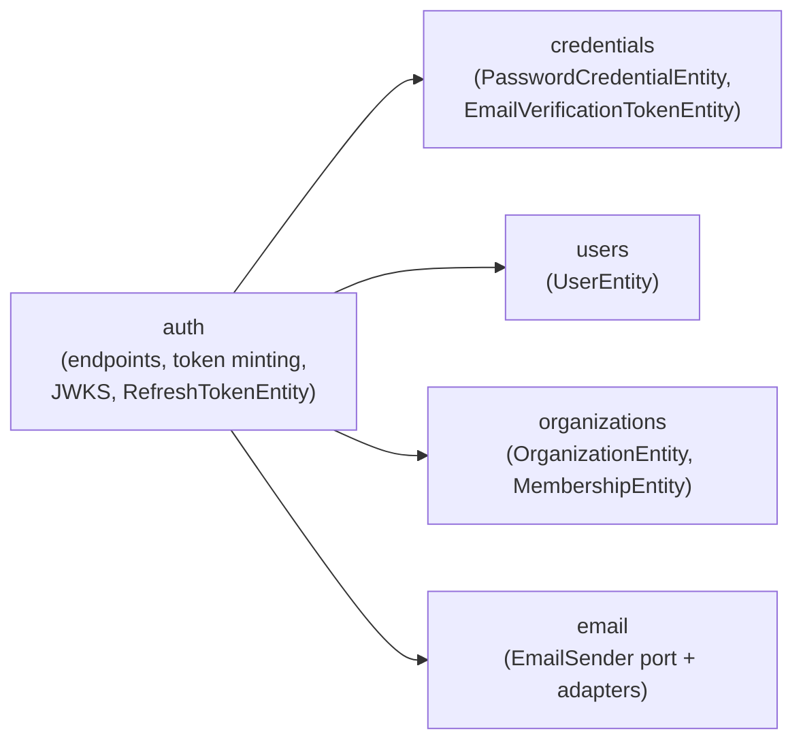

# Authentication and tokens

<!-- reference-table:start -->
| Field | Value |
| ----- | ----- |
| ID | 000002 |
| Title | Authentication and tokens |
| Description | How registration, email verification, login, JWT access tokens, refresh-token families, and the abuse defenses around them work end to end. |
| Tags | architecture, configuration, http, security |
| Created | 2026-07-27 |
| Updated | 2026-08-09 |
| Related | [000001](000001-persistence-foundation.md), [000003](000003-outbound-email.md), [000004](000004-request-throttling.md) |
<!-- reference-table:end -->

Registration, email verification, login, JWT access tokens, refresh-token
families, and the operational knobs around all of it. See
[000001](000001-persistence-foundation.md) for how the underlying schema and
datasource are configured; this doc covers what runs on top of that schema.
Every `/auth` route is also rate-limited, which [Request
throttling](000004-request-throttling.md) owns in full.

## Domains and boundaries

Four domains implement this — `users`, `organizations`, `credentials` and
`auth`, each a top-level package under `src/main/java/com/zarlania/api`.
They follow the domain-boundary rules `CLAUDE.md` states canonically:
entities stay inside their own domain, and a cross-domain reference is a
plain foreign-key id column plus a DTO lookup through the owning domain's
service.

The supporting classes this doc names live beside those four, in the
topic packages `CLAUDE.md` describes: `email` (the sender port and its
adapters), `errors` (the `ErrorCode` interface, `ProblemDetails` and the
framework-level exception handler) and `security` (`TokenHasher`). None of them
holds an entity or imports a domain — the dependency only ever runs from a
domain into them. The `throttle` and `http` packages sit alongside them and
guard every endpoint below without appearing in any of the flows; [Request
throttling](000004-request-throttling.md) covers both.



- **`users`** — `UserEntity`: `email` and `username` (both unique,
  case-insensitive via `citext`), `email_verified_at` (`null` until
  verified). Holds no password material and no tokens.
- **`organizations`** — `OrganizationEntity` (`name`, unique `citext`; `type` —
  `PERSONAL` or `GENERAL`) and `MembershipEntity` (`organization` mapped
  in-domain, `user_id` a plain FK id, `is_owner`). This flow only ever
  creates `PERSONAL` organizations, one per user, named after the username —
  `GENERAL` organizations are modeled but nothing here creates one yet.
- **`credentials`** — `PasswordCredentialEntity` (`user_id` FK id, Argon2id hash)
  and `EmailVerificationTokenEntity` (`user_id` FK id, SHA-256 token hash,
  expiry, consumed-at). Proof-of-identity material, kept out of the `users`
  domain deliberately so `UserEntity` never carries a password hash. It owns its
  configuration too (`zarlania.credentials`, bound by
  `CredentialsProperties`): `auth` depends on `credentials`, so a class
  here reading `zarlania.auth.*` would point that dependency backwards.
- **`auth`** — the `/auth/*` and `/.well-known/jwks.json` endpoints, JWT
  minting, and `RefreshTokenEntity` (family id, `user_id` + `organization_id` FK
  ids, SHA-256 token hash, expiry, used-at, revoked-at). Registration is
  orchestrated here too: `RegistrationService` decides the outcome and
  `AccountCreator` owns the transaction that writes it, both composing the
  other three domains through their services and DTOs rather than reaching
  into their entities.
- **`email`** — the `EmailSender` port and its two adapters
  (`ResendEmailSender` for a real provider, `LoggingEmailSender` for local
  dev). In the diagram above because registration depends on it, though it
  is topic infrastructure rather than a domain. [Outbound
  email](000003-outbound-email.md) covers it in full.

`GET /users/me` (in the `users` domain) and the JWKS endpoint (in `auth`) are
the two read paths that reach across these boundaries the same way every
other cross-domain read does: `UserController` calls `OrganizationService`
for the caller's organization DTO rather than touching `OrganizationEntity`
directly.

## Registration and email verification

`POST /auth/register` takes an email, username, and password.

1. **Validation:** email format; username 3–30 chars, `[a-z0-9-]` (it
   becomes the personal organization's name, so it has to stay
   URL/display-safe); password 12–128 chars with no composition rules —
   length beats forced symbol/case requirements per current NIST guidance.
   `POST /auth/login` caps the password at that same 128 characters, so a
   caller naming a real account cannot make the service Argon2-hash a body no
   registration could ever have stored. It deliberately does **not** repeat the
   12-character minimum: rejecting a short password before comparing it would
   answer a question about the account rather than about the request. The
   ceiling is written out in both `RegisterRequest` and `LoginRequest`, since an
   annotation value has to be a compile-time constant — lowering one without the
   other locks existing accounts out.
2. **One transaction:** `AccountCreator.createAccount` creates the
   unverified `UserEntity`, its `PasswordCredentialEntity`, the personal
   `OrganizationEntity`, the owning `MembershipEntity` and the verification
   token together. The
   verification email is requested via a Spring application event
   (`VerificationEmailRequested`) that `RegistrationEmailListener` only acts
   on `AFTER_COMMIT` — a failing email provider must never roll back a
   registration that otherwise succeeded, and a rolled-back registration
   must never send mail for an account that no longer exists.
3. **Uniqueness is the database's ruling, not the pre-check's.**
   `RegistrationService.register` checks whether the username and email are
   taken, but nothing stops a competing registration from committing between
   a check and the insert that follows it. `users` has `citext` unique
   constraints on both columns, and the loser of that race sees a
   `DataIntegrityViolationException`. `register` is therefore deliberately
   **not** `@Transactional` — the transaction lives one level down in
   `AccountCreator`, so the conflict handling can run after that transaction
   has rolled back — and `resolveRegistrationConflict` re-asks the same two
   questions, now unambiguous because the winner has committed, and answers
   exactly as the sequential case would: `409 auth.username-taken`, or the
   same `202` and reminder email that an already-registered email gets.
   Anything that is not one of those two races is rethrown. Without this,
   paired requests would get a `500` for a free email and two identical
   `202`s for a taken one — an enumeration channel, on top of an ugly
   failure.
4. **Verification token:** a 256-bit random URL-safe value
   (`TokenHasher.newUrlSafeToken`); only its SHA-256 hash is stored
   (`TokenHasher.sha256Hex`), with a 24-hour TTL and single use. The emailed
   link points at `{APP_BASE_URL}/verify-email?token=…`, which the frontend
   turns into a `POST /auth/verify` call; success stamps
   `email_verified_at` and consumes the token.
5. **Both halves of "single use" are enforced by locks, not by hope.**
   Issuing deletes the user's outstanding tokens and inserts a new one;
   consuming reads `consumed_at` and then writes it. Neither pair is atomic
   on its own, and the entity has no version column. So `issue` takes a
   transaction-scoped advisory lock on the user before the delete — two
   concurrent issues could otherwise both delete before either insert became
   visible, leaving two live tokens — and `consume` reads through `SELECT …
   FOR UPDATE`, so two requests carrying the same token cannot both see it
   unconsumed and both report success. Postgres re-evaluates the row against
   its new version when the lock lifts, so the loser sees what the winner
   wrote. The advisory lock uses its own classifier (`EVTL`), distinct from
   the refresh families' `RFTL`, per the rule in [Refresh-family mutations
   are serialized by an advisory
   lock](#refresh-family-mutations-are-serialized-by-an-advisory-lock).
6. **Blocking verification:** an unverified account cannot log in —
   `POST /auth/login` fails with the distinct `auth.email-unverified` code.
   `POST /auth/resend` issues a fresh token (invalidating any outstanding
   one) for an unverified account.
7. **Re-registering an unverified email** re-sends verification rather than
   the duplicate-attempt notice, and **never alters the existing
   credentials**. The common case here is a first verification mail landing
   in spam, and the duplicate notice carries no link — it would tell that
   user to sign in to an account they cannot sign into. Leaving the
   credentials untouched is what stops a caller who does not control the
   mailbox from overwriting the password on someone else's account.
8. **Unverified expiry:** [Scheduled cleanup](#scheduled-cleanup) purges
   accounts still unverified past
   `zarlania.auth.unverified-account-max-age`, freeing the email,
   username, and organization name for reuse.

### Enumeration safety: status, body, and timing all have to match

Usernames are public, so a taken username is an honest `409
auth.username-taken`. Emails are not: **registering an email that already
belongs to another account returns the same `202` "check your email"
response as a genuine new registration**, and the existing owner is sent a
"someone tried to register with your email" notice instead of anything
reaching the caller. `resend` has the same shape — unknown email, already
verified, and freshly resent all return `202` with no way to tell them apart.
Login failures never reveal whether the identifier or the password was
wrong: both return the same `401 auth.invalid-credentials`, with an
identical response body (not just the same status and code).

Matching status and body is not sufficient on its own — an attacker who can
measure response time can still enumerate valid identifiers, because
Argon2id at [these parameters](#password-hashing) costs tens of
milliseconds while every early-return branch that skips it costs roughly
one millisecond for a single `SELECT`. To close that gap, **every branch
that would otherwise return early runs a throwaway Argon2 hash first**:

- `RegistrationService.register`, on the "email already registered" branch.
  The hash runs *before* that branch splits into re-sending verification
  and sending the duplicate notice, so those two are indistinguishable from
  each other as well.
- `RegistrationService.resend`, unconditionally on every branch — it has no
  real hashing work of its own to fall back on.
- `AuthTokenService.login`'s `authenticate` helper, on the "unknown
  identifier" branch, so it pays the same cost a "known identifier, wrong
  password" branch pays via `passwordMatches`.

All three call `CredentialsService.hashDecoyPassword()`, which hashes a
fixed, never-compared, never-persisted string and stores the result in a
static `AtomicReference` — not because anything reads that value, but
because a result nothing reads is exactly what the JIT is licensed to treat
as dead work and optimize away. The `AtomicReference` write gives the hash
call an externally observable effect the JIT cannot prove is safe to skip,
so the cost is actually paid. **This looks like pointless work; removing it
reopens the timing side-channel it exists to close.**

The hash is not the only cost that has to match. Sending an email costs far
more than hashing one password, and on `resend` only one of the three
outcomes sends anything at all — so if the send ran on the request thread,
response time alone would say which branch was taken and the decoy hash
would have bought nothing. `RegistrationEmailListener` therefore hands every
message to `EmailDispatcher` instead of sending inline. "After commit" is
not "after the response": a `@TransactionalEventListener` still runs on the
publishing thread, which is the request thread, so the round trip would land
squarely in the caller's measured time. A rejected submission (full queue)
is caught and logged for the same reason — only the sending branch could
ever observe it. The executor itself, and what those logs look like, are in
[Outbound email](000003-outbound-email.md).

## Login, access tokens, and refresh-token families

`POST /auth/login` takes an identifier — email **or** username — and a
password. Success mints a session scoped to the user's personal organization
(organization switching is out of scope for this design): an access JWT in
the JSON response body, and a refresh token as an httpOnly cookie. The
frontend is expected to hold the access token in memory only, never in
storage that survives a page reload.

### Access token (JWT)

| Claim | Meaning |
| ----- | ------- |
| `iss` | Issuer — `zarlania.auth.issuer` (`https://api.zarlania.com` in production). Checked on the way in: `SecurityConfig`'s decoder uses `JwtValidators.createDefaultWithIssuer`, because the default validator checks expiry only. |
| `sub` | The user's UUID. |
| `org` | The organization's UUID the token is scoped to. |
| `kind` | What the token proves, currently always `"user"` (`TokenKind.USER`) — a later `IMPERSONATION`/`SERVICE` kind is reserved but nothing mints one, and no authorization decision reads this claim yet. See below for how it is written and checked. |
| `jti` | A random UUID, unique per token. |
| `iat` / `exp` | Issued-at / expiry — 15-minute TTL (`zarlania.auth.access-token-ttl`). |

Signed RS256 by `JwtService`, with the header's `kid` set to the signing
key's RFC 7638 thumbprint. Deliberately minimal: display data comes from
`GET /users/me`, not the token, and a roles/permissions claim is out of
scope for now.

On the public paths — `/auth/**`, `/.well-known/jwks.json` and
`/actuator/health` — the `Authorization` header is not read at all.
`permitAll` exempts a path from the authorization check, not from the filters
ahead of it: `BearerTokenAuthenticationFilter` still runs, and a header that
is expired, malformed, or signed by anyone else fails there, producing a `401`
no handler ever sees. `POST /auth/refresh` is where that bites. A browser
client with one global `Authorization` interceptor attaches its access token to
every call, so the moment that token expires, the request whose whole purpose
is to recover from that expiry would be refused for carrying it — valid refresh
cookie and matching CSRF token included. `SecurityConfig` therefore gives the
resource server a `BearerTokenResolver` that returns `null` on those paths, so
the filter skips the request instead of failing it. A *valid* token on a public
path is discarded too, which costs nothing: no public route reads the security
context.

`TokenKind` carries each kind's wire string explicitly instead of deriving it
from `name()`, because the claim value is published contract — renaming a
constant here must not be able to change what appears in a token. On the way in,
`SecurityConfig`'s authentication converter resolves the claim through
`TokenKind.fromValue`, so a token naming a kind this service does not know is
rejected with the same `401` a malformed `sub` or `org` gets rather than being
folded onto `USER`.

### Refresh tokens and families

Refresh tokens are **opaque**, not JWTs — a 256-bit random value, validated
against the `refresh_tokens` table, never decoded client-side. Only the
SHA-256 hash is stored.

- **Family:** every login starts a new family with an absolute
  `zarlania.auth.refresh-family-lifetime` (30 days) expiry, set once and
  never extended. `POST /auth/refresh` rotates the token — marks the
  presented one used, issues a new one in the same family — but the
  family's expiry never moves. A stolen cookie dies within 30 days
  regardless of how often it is refreshed; requiring re-login roughly
  monthly is the accepted cost of that ceiling.
- **Rotation:** `RefreshTokenService.rotate(raw)` looks up the token's
  family, re-checks the presented token is the family's current one and
  still active, marks it used, and inserts the next token in the family.
  `AuthTokenService.refresh` wraps this, re-checks the user behind the
  rotation still exists and is still verified, and mints a fresh access JWT
  alongside it. That user re-check is unreachable today — nothing deletes a
  verified user or un-verifies an email — but it is deliberate defense in
  depth: the first future feature to break one of those invariants (account
  deletion, disablement, email change with re-verification) would otherwise
  leave a dead account refreshing for the rest of its 30-day family. When
  the re-check fails, the just-rotated family is revoked before the request
  is rejected, so the failed refresh cannot itself leave a live token
  behind.
- **Reuse detection:** presenting a token that has already been marked used
  is treated as evidence of theft — the whole family is revoked
  (`RefreshTokenService.revokeFamily`), not just the replayed token, and
  every other still-live token in that family (including ones an attacker
  never touched) stops working too. The caller has to log in again from
  scratch. The caller sees only the same 401 any bad token gets, so the
  event is also logged at `WARN` with the greppable `REFRESH_TOKEN_REUSE`
  marker plus the user and family ids — the only place theft detection is
  visible to an operator, and the line an alert should match on. See
  [Reuse detection](#reuse-detection-needs-norollbackfor) below
  for why this needs a non-default transaction setting to actually work.
- **Logout:** `POST /auth/logout` revokes the whole family
  (`AuthTokenService.logout` → `RefreshTokenService.revokeFamilyOf`) and
  clears the cookie. Any access token already issued keeps working until it
  naturally expires — the design is stateless by choice, so a 15-minute
  window of continued access after logout is an accepted trade-off, not an
  oversight.

`POST /auth/refresh` and `POST /auth/logout` are the only two routes on this
service that authenticate with a cookie, which makes them the only two that
require a CSRF token. Both expect one, fetched from `GET /auth/csrf` — see
[CSRF protection is scoped, not
disabled](#csrf-protection-is-scoped-not-disabled) for the client contract.

### Refresh cookie

`AuthController` sets the cookie named `zarlania_refresh` with:

| Attribute | Value | Why |
| --------- | ----- | --- |
| `HttpOnly` | always | Keeps it unreadable from JavaScript — the one defense against a token-stealing XSS bug. |
| `Secure` | `zarlania.auth.cookie-secure` (`true` in production, `false` for local `http://` dev) | The cookie must never traverse a plaintext connection in production, but requiring it locally would break a plain `http://localhost` frontend. |
| `SameSite` | `Strict` | Keeps the cookie off cross-site requests entirely — the outer layer of the defense the CSRF token completes, see [CSRF protection is scoped, not disabled](#csrf-protection-is-scoped-not-disabled). |
| `Path` | `/auth` | Scopes the cookie to the auth endpoints only; it is never sent to `/users/me` or any other route. |
| `Max-Age` | seconds until `familyExpiresAt` on login/refresh; `0` on logout | Ties the browser-side cookie lifetime to the same 30-day family ceiling the server enforces, and `0` is what makes the browser drop it immediately on logout. |

Logout builds its cleared cookie through the exact same `buildRefreshCookie`
helper the live cookie uses, varying only the value and `Max-Age` — so the
two can never drift apart on `HttpOnly`/`Secure`/`SameSite`/`Path`.

**Two cookies of the same name is a refusal, not a coin toss.** Any other host
under the registrable domain — anything at `*.zarlania.com` — can set a cookie
named `zarlania_refresh` with `Domain=zarlania.com`, which the browser then
sends alongside this service's own, stripped of the domain and path that would
tell the two apart. That is cookie tossing, and it arrives on the legitimate
client's own request. `POST /auth/refresh` therefore reads every cookie under
the name off the raw request rather than through `@CookieValue`, which is
single-valued and so cannot see the difference, and refuses the request with
`auth.invalid-credentials` when more than one arrives: silently picking one is
how a caller ends up holding a session somebody else chose. `POST /auth/logout`
resolves the same ambiguity the other way and revokes *every* family presented,
because the caller wants out of all of them and revoking only the first would
leave one live precisely when something has gone wrong enough to produce two.
The same trick aimed at the `XSRF-TOKEN` cookie is why the CSRF token is read
from a header only — see [CSRF protection is scoped, not
disabled](#csrf-protection-is-scoped-not-disabled).

## Password hashing

`PasswordEncoderConfig` configures Spring Security's `Argon2PasswordEncoder`
at the OWASP Argon2id baseline:

| Parameter | Value |
| --------- | ----- |
| Salt length | 16 bytes |
| Hash length | 32 bytes |
| Parallelism | 1 |
| Memory | 19,456 KiB (19 MiB) |
| Iterations | 2 |

Every stored hash records the parameters it was produced with, so
strengthening them later takes effect only on a user's *next* successful
password change or reset — nothing needs a bulk rehash migration.

**One hash fits the free tier; unbounded concurrent hashes do not.**
BouncyCastle allocates that 19 MiB working buffer on the *Java heap*, and
`render.yaml`'s `-XX:MaxRAMPercentage=70` leaves roughly 358 MB of heap on
a 512 MB instance — so about 19 simultaneous hashes exhaust it and the
container is OOM-killed. Unauthenticated `/auth/login` traffic alone can
reach that, since the decoy hash makes an unknown identifier cost exactly
as much as a real one.

`CredentialsService` therefore gates **every** hash it performs behind a
semaphore of `zarlania.credentials.max-concurrent-hashes` permits (4, so
about 76 MiB at peak); `server.tomcat.threads.max` bounds how many
requests can queue behind it. The decoy hash deliberately takes a permit
like any other: a decoy that skipped the gate would answer immediately
while a real hash waited under load, reopening the very timing channel it
exists to close.

## JWKS and key rotation

`GET /.well-known/jwks.json` publishes the current signing key's public half
plus any retired public keys, built by `JwtKeys` and served by
`JwksController`. Spring Security's own resource-server filter chain
(`SecurityConfig`) verifies incoming access tokens against this same key
set via `NimbusJwtDecoder`.

- **Local/dev, no key configured:** `JwtKeys` generates a fresh ephemeral
  2048-bit RSA keypair at startup. Convenient for local development —
  restarting the app invalidates every previously issued token, which is
  fine outside production.
- **Production, no key configured:** startup fails fast with an
  `IllegalStateException` rather than silently falling back to an ephemeral
  key that would invalidate every token on every restart or deploy.

**Rotation runbook**, done entirely through configuration — no code change:

1. Generate a new key pair:
   `openssl genpkey -algorithm RSA -pkeyopt rsa_keygen_bits:2048`.
2. Set `JWT_PRIVATE_KEY` (Render env var, `zarlania.auth.jwt-private-key-pem`)
   to the new private key's PEM.
3. Move the **old** key's public PEM into `JWT_RETIRED_PUBLIC_KEYS`
   (`zarlania.auth.jwt-retired-public-keys-pem`) — multiple PEM blocks are
   supported, concatenated. `JwtKeys` publishes every retired key alongside
   the current one in the JWKS response, so tokens signed with the old key
   still verify.
4. Deploy. New tokens sign with the new key; old, still-live access tokens
   (up to the 15-minute TTL) keep verifying against the retired public key.
5. Once 15 minutes have passed since the deploy, no token signed with the
   old key can still be unexpired — drop it from `JWT_RETIRED_PUBLIC_KEYS`.

Env vars carry PEM blocks with either real or escaped newlines depending on
how the hosting platform injects them. Render's dashboard stores a pasted
multi-line value verbatim, but a value supplied through its API, a `.env`
file or `docker run --env` arrives on one line with every break written as
the two characters `\n`. `JwtKeys` strips both spellings — the escape
sequences first, then real whitespace — before base64-decoding. The order
matters: strip only real whitespace and the backslashes stay in the Base64
body, where the strict decoder rejects them. That throws inside `JwtKeys`'
constructor, so the service fails to start rather than failing one request.

## Throttling

Every `/auth` route carries a rate limit — a bucket keyed on the caller's
address, and for the routes that name an account in their body a second one
keyed on that account across every address. The one thing worth restating here
is what that second bucket is *not*: it is neither an account lockout nor an
enumeration channel. It exists for whatever string the caller supplied, matched
to a real account or not, so a `429` never says an identifier is real — the same
property [enumeration
safety](#enumeration-safety-status-body-and-timing-all-have-to-match) depends on
everywhere else.

[Request throttling](000004-request-throttling.md) has the mechanism, the
per-endpoint limits and the reasoning behind each number, and the client-IP
source the per-IP bucket keys on.

## Scheduled cleanup

Two independent sweeps, both on `zarlania.auth.cleanup-interval` (1 hour
by default). They are separate beans so either can fail without stopping
the other. `spring.task.scheduling.pool.size` is 3 — one thread per
`@Scheduled` method in the application: these two sweeps, which share
`cleanup-interval` and so occupy their threads at the same time, plus
`InMemoryRateLimiter`'s [per-minute
eviction](000004-request-throttling.md#the-limiter-is-in-memory-and-swept). Spring's default
single-threaded scheduler, or any size below the number of scheduled
methods, would let a sweep running long against a cold free-tier database
stall that eviction and leave the limiter's map growing. **Add a thread
whenever a `@Scheduled` method is added.**

**`UnverifiedAccountCleanup`** purges every account still unverified past
`zarlania.auth.unverified-account-max-age` (7 days by default). Left
alone, an abandoned signup reserves its email, username, and organization
name forever — all three are `citext NOT NULL UNIQUE`, so nobody else
could ever register with them. See [Unverified-account cleanup is two
beans, not one](#unverified-account-cleanup-is-two-beans-not-one) below
for why the purge itself lives in a second, separate bean.

**`ExpiredTokenCleanup`** deletes token rows nothing can read again, which
the account sweep never covers because it only ever looks at unverified
users:

- `refresh_tokens` past `family_expires_at`. An active session refreshing
  on the 15-minute access TTL inserts around 96 rows a day — roughly
  35,000 per user per year, against a 1 GB free-tier database.
- `email_verification_tokens` that are consumed or expired.
  `EmailVerificationService.issue` clears only a user's *unconsumed*
  tokens, so consumed ones would otherwise accumulate forever.

Refresh tokens are pruned at the family's absolute expiry and **not** as
soon as a token is used or revoked. A used row has to stay readable until
then, because presenting it a second time is exactly what proves theft and
revokes the family; deleting it earlier would turn a replay into an
ordinary unknown-token `401` and lose the detection.

## Manual setup

Nothing here happens automatically; each of these is a one-time step a
maintainer performs outside this repository.

1. **Render env vars.** In the Render dashboard, set `JWT_PRIVATE_KEY` and
   (only once a rotation is in flight) `JWT_RETIRED_PUBLIC_KEYS`. Both are
   declared with `sync: false` in `render.yaml` — the blueprint reserves the
   slot, but the value is never committed and has to be entered by hand in
   the dashboard.
2. **Local development.** Leave `JWT_PRIVATE_KEY` unset and `JwtKeys` falls
   back to an ephemeral dev keypair. `.env.example` documents the local-only
   knobs (`AUTH_COOKIE_SECURE=false` in particular — see the cookie table
   above).

Sending real verification email needs a provider account, DNS records and a
third `sync: false` env var; [Outbound
email](000003-outbound-email.md#manual-setup) has that setup, and what happens
locally when it is skipped.

## Design decisions worth preserving

Each of the following exists to close a specific gap that is not visible
from reading the surrounding code in isolation. A future change that
"simplifies" one of these away should re-derive why it existed first.

### Refresh-family mutations are serialized by an advisory lock

Rotating a token and revoking a family both have to see every other row in
the same family, including ones committed by a concurrent request on the
same family. `RefreshTokenService.rotate` and `revokeFamilyOf` both take a
Postgres transaction-scoped advisory lock
(`pg_advisory_xact_lock`, via `RefreshTokenRepository.acquireFamilyLock`)
before touching any row, keyed on a 32-bit fold of the family's UUID.

Without it, a logout racing a refresh on the same family can miss the
successor row the in-flight refresh is about to insert: under Postgres's
read-committed snapshot rules, a revocation's own locked read can unblock
without ever seeing a row that was inserted by the transaction it was
waiting on, leaving that one token live and un-revoked for up to the full
30-day family lifetime. The advisory lock is taken *before* any row is
read, so every `rotate()`/`revokeFamilyOf()` call on the same family is
fully serialized against every other one, closing that gap. The row-level
`PESSIMISTIC_WRITE` lock on `findByFamilyIdOrderById` (always acquired in
ascending-id order) stays in place too, as defense in depth: even if the
advisory lock were ever skipped by a future bug, two callers taking row
locks in a fixed order can never deadlock against each other.

### Reuse detection needs `noRollbackFor`

`RefreshTokenService.rotate` is annotated
`@Transactional(noRollbackFor = ReusedRefreshTokenException.class)`. Without
that, Spring's default rule for an unchecked exception thrown out of a
`@Transactional` method marks the transaction rollback-only — which would
silently discard the family revocation `rotate()` just performed at commit
time, the moment `ReusedRefreshTokenException` propagates to signal the
reuse. That would make theft detection a complete no-op: the exception
would still reach the caller as a `401`, but the family would remain live
underneath it, exactly the behavior
[`AuthJourneyFlowTest`](../../src/test/java/com/zarlania/api/auth/controllers/AuthJourneyFlowTest.java)
exists to catch if it ever regresses.

### CSRF protection is scoped, not disabled

`SecurityConfig` leaves CSRF protection on but narrows it, with
`requireCsrfProtectionMatcher`, to exactly two routes: `POST /auth/refresh`
and `POST /auth/logout`.

Everything else is exempt because there is nothing there to forge. Every
endpoint but `/auth/**`, `/.well-known/jwks.json` and `/actuator/health`
authenticates with an `Authorization: Bearer` header, which a browser never
attaches on its own — a forged cross-site request arrives with no credential
at all. The remaining `/auth` routes authenticate with what is in the
request body (`register`, `verify`, `resend`, `login`), so forging one gains
nothing either; `GET /auth/csrf` is a safe method and carries no credential to
begin with. CSRF defends the *ambient*-credential case, and those two
routes are the only ones this service has: both read the `zarlania_refresh`
cookie, which the browser does attach automatically.

The check is a double submit. `CookieCsrfTokenRepository` puts the token in
an `XSRF-TOKEN` cookie and requires the same value back in an `X-XSRF-TOKEN`
header; an attacker's page can make the browser send the cookie but cannot
read it to build the header.

The header is the *only* place the token is read from.
`HeaderOnlyCsrfTokenRequestHandler` replaces Spring's stock handler, which also
accepts the token from a `_csrf` request parameter — right for a server-rendered
form, and a fallback that would undo the whole defense here. The threat this
section exists for is a compromised host under the registrable domain, which is
*same-site*, so `SameSite=Strict` still lets it send the refresh cookie. That
page can toss an `XSRF-TOKEN` cookie of its own choosing — [cookie
tossing](#refresh-cookie) again — before the client has ever called
`GET /auth/csrf`, then POST a plain HTML form carrying a matching `_csrf` field:
no preflight, no reading of the `HttpOnly` cookie, and the two values match. A
header is the half a form cannot produce, and anything that can set one is doing
so from script, where CORS applies and the allow-list names one origin.

Where this departs from the usual single-page-app recipe is that the cookie
stays `HttpOnly`. That recipe has the client read the cookie with
`document.cookie`, which cannot work here — the browser client is served
from `zarlania.com` while this API sets cookies for `api.zarlania.com`, and
`document.cookie` is scoped by host, not by site. `GET /auth/csrf` hands the
client the token over CORS instead, which is strictly better: the cookie
stays unreadable to script, so an XSS on any sibling host cannot lift it.

**Client contract.** Before calling `POST /auth/refresh` or `POST
/auth/logout`, call `GET /auth/csrf`. It answers with the token and the name
of the header to put it in:

```json
{ "headerName": "X-XSRF-TOKEN", "token": "..." }
```

and sets the matching cookie on the same response. Send that value in that
header on both routes. The token can be reused for as long as the cookie
lives, so a client fetches it once per cold start rather than per request —
but it must fetch it *again* after a page reload, because the refresh cookie
is `HttpOnly` and survives the reload while a token held in memory does not.
The header name is reported rather than fixed so clients read it from the
server instead of hardcoding it; it is also on the CORS allow-list, without
which the browser's preflight would refuse the very header the check needs.

The token is defense in depth rather than the first line. Three things
already stand in front of it: `SameSite=Strict` keeps the refresh cookie off
cross-site requests entirely, `Path=/auth` keeps it from being attached to
any other endpoint, and the CORS allow-list
(`zarlania.cors.allowed-origins`) is an explicit list of origins, never a
wildcard — which is also what makes `allowCredentials(true)` safe (Spring
refuses to start with `allowCredentials(true)` paired with a `"*"` origin).
What the token adds is the cases those three do not cover: a same-site but
untrusted origin — any other host under the registrable domain — and
browsers or extensions where `SameSite` is not honoured as advertised.

A rejected request fails in the filter chain, before any controller runs, so
it returns a bare `403` rather than the `ErrorCode` envelope the rest of the
API uses. That matches how the bearer chain already reports a bad token.

### Timing-safe enumeration defenses via throwaway Argon2 hashes

The mechanism is described under [Enumeration
safety](#enumeration-safety-status-body-and-timing-all-have-to-match); it
is listed here because `CredentialsService.hashDecoyPassword()` reads as
dead code and invites deletion. Its entire value is the CPU time it burns.

Two details that look unrelated are load-bearing for the same reason:

- The decoy takes a [hashing permit](#password-hashing) like a real hash
  does, so it still waits its turn under load rather than answering early.
- `RegistrationService.resend` hashes *outside* any transaction. That
  change was about not holding a pooled connection for the 50 ms the hash
  takes; it deliberately did not move, skip or condition the hash itself.

### Unverified-account cleanup is two beans, not one

`UnverifiedAccountCleanup` (the `@Scheduled` sweep) and
`UnverifiedAccountPurger` (the `@Transactional` per-account delete) are two
separate Spring beans rather than two methods on one class. A `@Scheduled`
method calling a `@Transactional` method on **itself** is a self-invocation
that bypasses Spring's AOP proxy entirely, so the "transactional" method
would actually run with no transaction at all — silently defeating the
one-transaction-per-user guarantee that keeps one bad row from corrupting
another user's deletion. Splitting them into two beans means
`UnverifiedAccountCleanup` calls `UnverifiedAccountPurger.purgeOneAccount`
through Spring's normal inter-bean proxying, where the `@Transactional`
annotation actually takes effect. The sweep also catches and logs any
`RuntimeException` per account (`purgeSafely`) rather than letting one bad
row abort the whole pass — every other expired account still gets purged on
the same run, and the failed one is retried on the next scheduled pass.

### The purge re-checks verification before it deletes

The sweep lists its candidates in one transaction and purges each of them in
another, so by the time a purge runs its listing is already a little stale.
A real user whose verification mail sat in spam past the deadline can call
`POST /auth/resend` and click the link inside that gap — and purging on the
strength of the stale listing would then destroy a live, verified account.

So `purgeOneAccount` finishes with `UserService.deleteIfStillUnverified`,
which is a single conditional statement (`delete … where id = ? and
email_verified_at is null`) rather than a read followed by a delete: under
`READ COMMITTED` that pair can straddle the very commit it is trying to
detect. If it removes no row, the account was verified mid-sweep, and
`AccountVerifiedDuringPurgeException` rolls the whole transaction back —
including the credential, token and organization rows already deleted above,
which would otherwise leave a live user with no way to sign in. The sweep
catches that one exception separately and logs it at `debug`, because it is
the expected outcome of a race the design intends to lose safely, not a
failure worth paging anyone about.

The delete is also `@Modifying(flushAutomatically = true)`. It executes as
SQL and does not see the persistence context, so without the flush the
membership and credential deletes queued earlier in the same transaction
would reach the database *after* it, and Postgres would reject it on the
foreign key those deletes were meant to have cleared.

The order the purge takes its locks is load-bearing too.
`RegistrationService.verify` locks the verification-token row (inside
`consume`) before the user row (inside `markEmailVerified`), and
`purgeOneAccount` takes the same two in the same order, because
`deleteAllForUser` clears the verification tokens first. Two callers
acquiring the same locks in the same sequence cannot form an AB-BA cycle, so
whichever arrives second waits and then sees the other's committed result.
