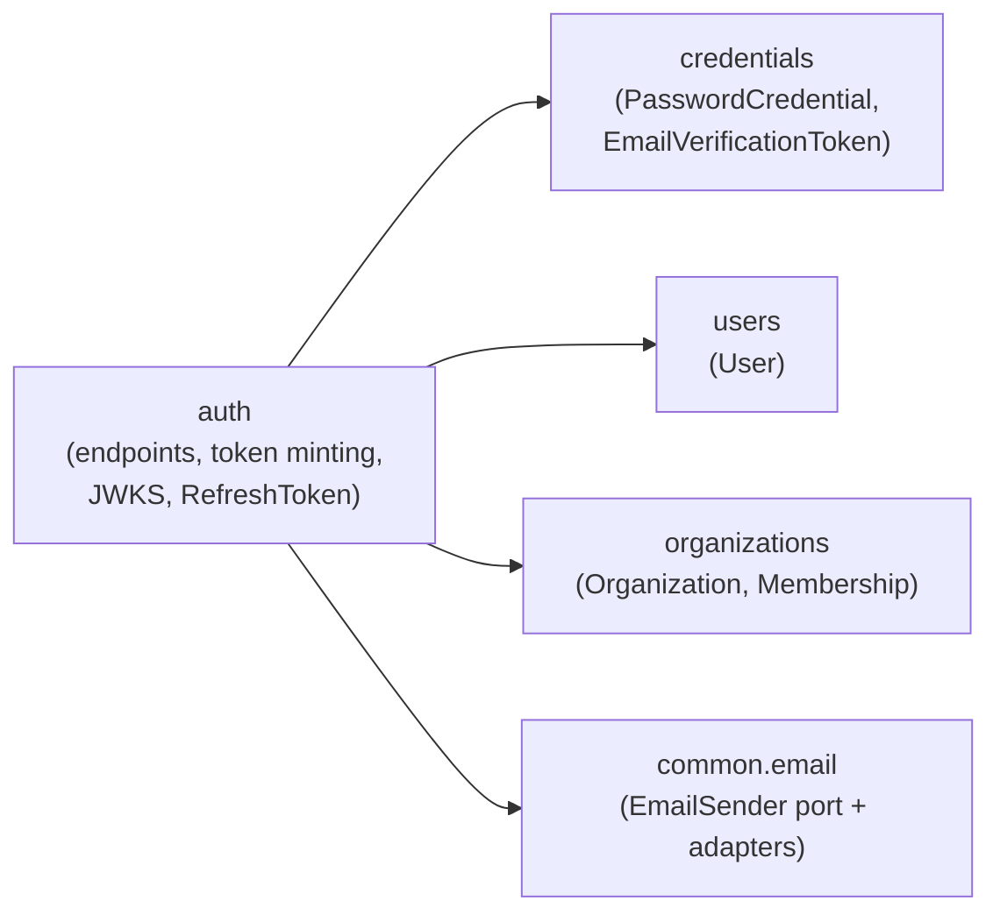

# Authentication and tokens

<!-- reference-table:start -->
| Field | Value |
| ----- | ----- |
| ID | 000002 |
| Title | Authentication and tokens |
| Description | How registration, login, JWT access tokens, refresh-token families, and email verification work end to end. |
| Tags | architecture, configuration, security |
| Created | 2026-07-27 |
| Updated | 2026-07-27 |
| Related | [000001](000001-persistence-foundation.md) |
<!-- reference-table:end -->

Registration, email verification, login, JWT access tokens, refresh-token
families, and the operational knobs around all of it. See
[000001](000001-persistence-foundation.md) for how the underlying schema and
datasource are configured; this doc covers what runs on top of that schema.

## Domains and boundaries

Five domains implement this, each a top-level package under
`src/main/java/com/zarlania/api`, following `CLAUDE.md`'s convention:
entities never leave their own domain, and a cross-domain reference is a
plain foreign-key id column plus a DTO lookup through the owning domain's
service.

- **`users`** — the `User` entity: `email` and `username` (both unique,
  case-insensitive via `citext`), `email_verified_at` (`null` until
  verified). Holds no password material and no tokens.
- **`organizations`** — `Organization` (`name`, unique `citext`; `type` —
  `PERSONAL` or `GENERAL`) and `Membership` (`organization` mapped
  in-domain, `user_id` a plain FK id, `is_owner`). This flow only ever
  creates `PERSONAL` organizations, one per user, named after the username —
  `GENERAL` organizations are modeled but nothing here creates one yet.
- **`credentials`** — `PasswordCredential` (`user_id` FK id, Argon2id hash)
  and `EmailVerificationToken` (`user_id` FK id, SHA-256 token hash,
  expiry, consumed-at). Proof-of-identity material, kept out of the `users`
  domain deliberately so `User` never carries a password hash.
- **`auth`** — the `/auth/*` and `/.well-known/jwks.json` endpoints, JWT
  minting, and `RefreshToken` (family id, `user_id` + `organization_id` FK
  ids, SHA-256 token hash, expiry, used-at, revoked-at). Registration is
  orchestrated here too: `RegistrationService` runs as one service, one
  transaction, composing the other three domains through their services and
  DTOs rather than reaching into their entities.
- **`common.email`** — the `EmailSender` port and its two adapters
  (`ResendEmailSender` for a real provider, `LoggingEmailSender` for local
  dev). No entities — domain-agnostic infrastructure, the same category as
  `common.persistence`.

`GET /users/me` (in the `users` domain) and the JWKS endpoint (in `auth`) are
the two read paths that reach across these boundaries the same way every
other cross-domain read does: `UserController` calls `OrganizationService`
for the caller's organization DTO rather than touching `Organization`
directly.

## Registration and email verification

`POST /auth/register` takes an email, username, and password.

1. **Validation:** email format; username 3–30 chars, `[a-z0-9-]` (it
   becomes the personal organization's name, so it has to stay
   URL/display-safe); password 12–128 chars with no composition rules —
   length beats forced symbol/case requirements per current NIST guidance.
2. **One transaction:** `RegistrationService.register` creates the
   unverified `User`, its `PasswordCredential`, the personal `Organization`,
   and the owning `Membership` together. The verification email is
   requested via a Spring application event
   (`VerificationEmailRequested`) that `RegistrationEmailListener` only acts
   on `AFTER_COMMIT` — a failing email provider must never roll back a
   registration that otherwise succeeded, and a rolled-back registration
   must never send mail for an account that no longer exists.
3. **Verification token:** a 256-bit random URL-safe value
   (`TokenHasher.newUrlSafeToken`); only its SHA-256 hash is stored
   (`TokenHasher.sha256Hex`), with a 24-hour TTL and single use. The emailed
   link points at `{APP_BASE_URL}/verify-email?token=…`, which the frontend
   turns into a `POST /auth/verify` call; success stamps
   `email_verified_at` and consumes the token.
4. **Blocking verification:** an unverified account cannot log in —
   `POST /auth/login` fails with the distinct `auth.email-unverified` code.
   `POST /auth/resend` issues a fresh token (invalidating any outstanding
   one) for an unverified account.
5. **Unverified expiry:** [Unverified-account
   cleanup](#unverified-account-cleanup) purges accounts still unverified
   past `zarlania.auth.unverified-account-max-age`, freeing the email,
   username, and organization name for reuse.

### Enumeration safety: status, body, and timing all have to match

Usernames are public, so a taken username is an honest `409
auth.username-taken`. Emails are not: **registering an email that already
belongs to another account returns the same `202` "check your email"
response as a genuine new registration**, and the existing owner is sent a
"someone tried to register with your email" notice instead of anything
reaching the caller. `resend` has the same shape — unknown email, already
verified, and freshly resent all return `202` with no way to tell them apart.
Login failures never reveal whether the identifier or the password was
wrong: both return the same `401 auth.invalid-credentials`, with an
identical response body (not just the same status and code).

Matching status and body is not sufficient on its own — an attacker who can
measure response time can still enumerate valid identifiers, because Argon2id
(`PasswordEncoderConfig`'s parameters below) costs tens of milliseconds while
every early-return branch that skips it costs roughly one millisecond for a
single `SELECT`. To close that gap, **every branch that would otherwise
return early runs a throwaway Argon2 hash first**:

- `RegistrationService.register`, on the "email already registered" branch,
  and `RegistrationService.resend`, unconditionally on every branch (it has
  no real hashing work of its own to fall back on).
- `AuthTokenService.login`'s `authenticate` helper, on the "unknown
  identifier" branch, so it pays the same cost a "known identifier, wrong
  password" branch pays via `passwordMatches`.

All three call `CredentialsService.hashDecoyPassword()`, which hashes a
fixed, never-compared, never-persisted string and stores the result in a
static `AtomicReference` — not because anything reads that value, but
because a result nothing reads is exactly what the JIT is licensed to treat
as dead work and optimize away. The `AtomicReference` write gives the hash
call an externally observable effect the JIT cannot prove is safe to skip,
so the cost is actually paid. **This looks like pointless work; removing it
reopens the timing side-channel it exists to close.**

## Login, access tokens, and refresh-token families

`POST /auth/login` takes an identifier — email **or** username — and a
password. Success mints a session scoped to the user's personal organization
(organization switching is out of scope for this design): an access JWT in
the JSON response body, and a refresh token as an httpOnly cookie. The
frontend is expected to hold the access token in memory only, never in
storage that survives a page reload.

### Access token (JWT)

| Claim | Meaning |
| ----- | ------- |
| `iss` | Issuer — `zarlania.auth.issuer` (`https://api.zarlania.com` in production). |
| `sub` | The user's UUID. |
| `org` | The organization's UUID the token is scoped to. |
| `kind` | Discriminator, currently always `"user"` (`TokenKinds.USER`) — reserved for a later `IMPERSONATION`/`SERVICE` kind, not yet minted or checked anywhere. |
| `jti` | A random UUID, unique per token. |
| `iat` / `exp` | Issued-at / expiry — 15-minute TTL (`zarlania.auth.access-token-ttl`). |

Signed RS256 by `JwtService`, with the header's `kid` set to the signing
key's RFC 7638 thumbprint. Deliberately minimal: display data comes from
`GET /users/me`, not the token, and a roles/permissions claim is out of
scope for now.

### Refresh tokens and families

Refresh tokens are **opaque**, not JWTs — a 256-bit random value, validated
against the `refresh_tokens` table, never decoded client-side. Only the
SHA-256 hash is stored.

- **Family:** every login starts a new family with an absolute
  `zarlania.auth.refresh-family-lifetime` (30 days) expiry, set once and
  never extended. `POST /auth/refresh` rotates the token — marks the
  presented one used, issues a new one in the same family — but the
  family's expiry never moves. A stolen cookie dies within 30 days
  regardless of how often it is refreshed; requiring re-login roughly
  monthly is the accepted cost of that ceiling.
- **Rotation:** `RefreshTokenService.rotate(raw)` looks up the token's
  family, re-checks the presented token is the family's current one and
  still active, marks it used, and inserts the next token in the family.
  `AuthTokenService.refresh` wraps this and mints a fresh access JWT
  alongside it.
- **Reuse detection:** presenting a token that has already been marked used
  is treated as evidence of theft — the whole family is revoked
  (`RefreshTokenService.revokeFamily`), not just the replayed token, and
  every other still-live token in that family (including ones an attacker
  never touched) stops working too. The caller has to log in again from
  scratch. See [Reuse detection](#reuse-detection-needs-norollbackfor) below
  for why this needs a non-default transaction setting to actually work.
- **Logout:** `POST /auth/logout` revokes the whole family
  (`AuthTokenService.logout` → `RefreshTokenService.revokeFamilyOf`) and
  clears the cookie. Any access token already issued keeps working until it
  naturally expires — the design is stateless by choice, so a 15-minute
  window of continued access after logout is an accepted trade-off, not an
  oversight.

### Refresh cookie

`AuthController` sets the cookie named `zarlania_refresh` with:

| Attribute | Value | Why |
| --------- | ----- | --- |
| `HttpOnly` | always | Keeps it unreadable from JavaScript — the one defense against a token-stealing XSS bug. |
| `Secure` | `zarlania.auth.cookie-secure` (`true` in production, `false` for local `http://` dev) | The cookie must never traverse a plaintext connection in production, but requiring it locally would break a plain `http://localhost` frontend. |
| `SameSite` | `Strict` | Keeps the cookie off cross-site requests entirely — see [CSRF is disabled deliberately](#csrf-is-disabled-deliberately). |
| `Path` | `/auth` | Scopes the cookie to the auth endpoints only; it is never sent to `/users/me` or any other route. |
| `Max-Age` | seconds until `familyExpiresAt` on login/refresh; `0` on logout | Ties the browser-side cookie lifetime to the same 30-day family ceiling the server enforces, and `0` is what makes the browser drop it immediately on logout. |

Logout builds its cleared cookie through the exact same `buildRefreshCookie`
helper the live cookie uses, varying only the value and `Max-Age` — so the
two can never drift apart on `HttpOnly`/`Secure`/`SameSite`/`Path`.

## Password hashing

`PasswordEncoderConfig` configures Spring Security's `Argon2PasswordEncoder`
at the OWASP Argon2id baseline:

| Parameter | Value |
| --------- | ----- |
| Salt length | 16 bytes |
| Hash length | 32 bytes |
| Parallelism | 1 |
| Memory | 19,456 KiB (19 MiB) |
| Iterations | 2 |

These parameters keep the hash comfortably inside the Render free tier's
512 MB. They are self-describing inside the stored hash string, so
strengthening them later only takes effect for a user's *next* successful
password change or reset — nothing needs a bulk rehash migration.

## JWKS and key rotation

`GET /.well-known/jwks.json` publishes the current signing key's public half
plus any retired public keys, built by `JwtKeys` and served by
`JwksController`. Spring Security's own resource-server filter chain
(`SecurityConfig`) verifies incoming access tokens against this same key
set via `NimbusJwtDecoder`.

- **Local/dev, no key configured:** `JwtKeys` generates a fresh ephemeral
  2048-bit RSA keypair at startup. Convenient for local development —
  restarting the app invalidates every previously issued token, which is
  fine outside production.
- **Production, no key configured:** startup fails fast with an
  `IllegalStateException` rather than silently falling back to an ephemeral
  key that would invalidate every token on every restart or deploy.

**Rotation runbook**, done entirely through configuration — no code change:

1. Generate a new key pair:
   `openssl genpkey -algorithm RSA -pkeyopt rsa_keygen_bits:2048`.
2. Set `JWT_PRIVATE_KEY` (Render env var, `zarlania.auth.jwt-private-key-pem`)
   to the new private key's PEM.
3. Move the **old** key's public PEM into `JWT_RETIRED_PUBLIC_KEYS`
   (`zarlania.auth.jwt-retired-public-keys-pem`) — multiple PEM blocks are
   supported, concatenated. `JwtKeys` publishes every retired key alongside
   the current one in the JWKS response, so tokens signed with the old key
   still verify.
4. Deploy. New tokens sign with the new key; old, still-live access tokens
   (up to the 15-minute TTL) keep verifying against the retired public key.
5. Once 15 minutes have passed since the deploy, no token signed with the
   old key can still be unexpired — drop it from `JWT_RETIRED_PUBLIC_KEYS`.

Env vars carry PEM blocks with either literal or escaped newlines depending
on how the hosting platform injects them; `JwtKeys` strips all whitespace
before base64-decoding rather than assuming one particular line-break style.

## Throttling

`InMemoryRateLimiter` is a fixed-window limiter, one counter per
`<endpoint>:<client-ip>` key, backing the `RateLimiter` interface
`AuthController` depends on. Defaults, in `zarlania.throttle`
(`application.yml`), all per `zarlania.throttle.window` (1 minute):

| Endpoint | Limit |
| -------- | ----- |
| `register` | 5/min |
| `login` | 10/min |
| `resend` | 3/min |
| `refresh` | 30/min |

A caller over the limit gets `429` with code `auth.throttled`. There is
deliberately **no account lockout** layered on top — locking an account
after N failed attempts is a trivial denial-of-service against a known
username; Argon2's cost plus these rate limits are considered the defense.

Client IP comes from `HttpServletRequest.getRemoteAddr()`, which only
resolves to the real caller — not Render's reverse proxy — because of
`server.forward-headers-strategy: framework` in `application.yml`; see
[Real client IPs need `forward-headers-strategy`](#real-client-ips-need-forward-headers-strategy)
below.

The limiter is in-memory rather than Redis-backed because Render's free
plan runs exactly one instance — distributed state would buy nothing today.
`RateLimiter` is a narrow, owned interface for exactly this reason: a
Redis-backed implementation can drop in behind it without any caller
changing, the day the service ever runs on more than one instance.

## Unverified-account cleanup

`UnverifiedAccountCleanup` runs on `zarlania.auth.cleanup-interval` (1 hour
by default) and purges every account still unverified past
`zarlania.auth.unverified-account-max-age` (7 days by default). Left alone,
an abandoned signup holds its email, username, and organization name
hostage forever — all three are `citext NOT NULL UNIQUE` — so nobody else
could ever register with them. See [Unverified-account cleanup is two
beans, not one](#unverified-account-cleanup-is-two-beans-not-one) below for
why the purge itself lives in a second, separate bean.

## Manual setup

Nothing here happens automatically; each of these is a one-time step a
maintainer performs outside this repository.

1. **Resend account.** Create an account at Resend (free tier, roughly
   3,000 emails/month) and generate an API key.
2. **DNS.** Add Resend's SPF and DKIM records to the `zarlania.com` DNS zone
   so outgoing mail from `EMAIL_FROM` (`no-reply@zarlania.com` by default)
   is authenticated and does not land in spam.
3. **Render env vars.** In the Render dashboard, set `RESEND_API_KEY`,
   `JWT_PRIVATE_KEY`, and (only once a rotation is in flight)
   `JWT_RETIRED_PUBLIC_KEYS`. All three are declared with `sync: false` in
   `render.yaml` — the blueprint reserves the slot, but the value is never
   committed and has to be entered by hand in the dashboard.
4. **Local development.** Leave `JWT_PRIVATE_KEY` and `RESEND_API_KEY`
   unset: `JwtKeys` falls back to an ephemeral dev keypair, and
   `EmailConfig` falls back to `LoggingEmailSender`, which logs the email
   instead of sending it. `.env.example` documents the local-only knobs
   (`AUTH_COOKIE_SECURE=false` in particular — see the cookie table above).

## Design decisions worth preserving

Each of the following exists to close a specific gap that is not visible
from reading the surrounding code in isolation. A future change that
"simplifies" one of these away should re-derive why it existed first.

### Refresh-family mutations are serialized by an advisory lock

Rotating a token and revoking a family both have to see every other row in
the same family, including ones committed by a concurrent request on the
same family. `RefreshTokenService.rotate` and `revokeFamilyOf` both take a
Postgres transaction-scoped advisory lock
(`pg_advisory_xact_lock`, via `RefreshTokenRepository.acquireFamilyLock`)
before touching any row, keyed on a 32-bit fold of the family's UUID.

Without it, a logout racing a refresh on the same family can miss the
successor row the in-flight refresh is about to insert: under Postgres's
read-committed snapshot rules, a revocation's own locked read can unblock
without ever seeing a row that was inserted by the transaction it was
waiting on, leaving that one token live and un-revoked for up to the full
30-day family lifetime. The advisory lock is taken *before* any row is
read, so every `rotate()`/`revokeFamilyOf()` call on the same family is
fully serialized against every other one, closing that gap. The row-level
`PESSIMISTIC_WRITE` lock on `findByFamilyIdOrderById` (always acquired in
ascending-id order) stays in place too, as defense in depth: even if the
advisory lock were ever skipped by a future bug, two callers taking row
locks in a fixed order can never deadlock against each other.

### Reuse detection needs `noRollbackFor`

`RefreshTokenService.rotate` is annotated
`@Transactional(noRollbackFor = ReusedRefreshTokenException.class)`. Without
that, Spring's default rule for an unchecked exception thrown out of a
`@Transactional` method marks the transaction rollback-only — which would
silently discard the family revocation `rotate()` just performed at commit
time, the moment `ReusedRefreshTokenException` propagates to signal the
reuse. That would make theft detection a complete no-op: the exception
would still reach the caller as a `401`, but the family would remain live
underneath it, exactly the behavior
[`AuthJourneyIntegrationTest`](../../src/test/java/com/zarlania/api/AuthJourneyIntegrationTest.java)
exists to catch if it ever regresses.

### Real client IPs need `forward-headers-strategy`

Render terminates TLS and proxies every request to this instance, so
without `server.forward-headers-strategy: framework` in `application.yml`,
`HttpServletRequest.getRemoteAddr()` would always resolve to Render's proxy
address, never the caller's. Every user would collapse into one shared
throttle bucket per endpoint, capping the entire service at, for instance,
5 registrations per minute *total* rather than per caller. `framework`
makes Spring's `ForwardedHeaderFilter` resolve the remote address from
`X-Forwarded-For` instead.

This is safe only because Render is the sole ingress this service is
reachable through: a client able to reach the app directly (bypassing
Render's proxy) could forge `X-Forwarded-For` to evade the limiter or frame
another IP as the source of its requests. If this service is ever exposed
another way — a second ingress, direct instance access — that path has to
either strip or overwrite `X-Forwarded-For` before the request reaches here,
or this setting needs revisiting.

### CSRF is disabled deliberately

`SecurityConfig` disables CSRF protection outright
(`http.csrf(csrf -> csrf.disable())`), which is safe specifically *because*
this is a stateless bearer-token API: every endpoint except `/auth/**`,
`/.well-known/jwks.json`, and `/actuator/health` requires an `Authorization:
Bearer` header, which is never sent ambiently by a browser the way a cookie
is — CSRF exists to defend exactly that ambient-credential case, which does
not apply here.

The one exception is the `zarlania_refresh` cookie `POST /auth/refresh`
reads. It is defended by three things working together instead of a CSRF
token: `SameSite=Strict` keeps the cookie off cross-site requests entirely;
`Path=/auth` keeps it from ever being attached to any other endpoint; and
the CORS allow-list (`zarlania.cors.allowed-origins`) is an explicit list of
origins, never a wildcard — which is also what makes
`allowCredentials(true)` on the CORS configuration safe (Spring refuses to
start with `allowCredentials(true)` paired with a `"*"` origin). If any one
of these three changes, this exception needs re-examining.

### Timing-safe enumeration defenses via throwaway Argon2 hashes

Covered above under [Enumeration
safety](#enumeration-safety-status-body-and-timing-all-have-to-match) —
called out again here because it is easy to mistake
`CredentialsService.hashDecoyPassword()` for dead code and delete it. Its
entire value is the CPU time it burns, not any value it produces; removing
it reopens a timing side-channel that lets a caller enumerate valid emails
or usernames purely by measuring response latency, even though the status
code and response body stay identical.

### Unverified-account cleanup is two beans, not one

`UnverifiedAccountCleanup` (the `@Scheduled` sweep) and
`UnverifiedAccountPurger` (the `@Transactional` per-account delete) are two
separate Spring beans rather than two methods on one class. A `@Scheduled`
method calling a `@Transactional` method on **itself** is a self-invocation
that bypasses Spring's AOP proxy entirely, so the "transactional" method
would actually run with no transaction at all — silently defeating the
one-transaction-per-user guarantee that keeps one bad row from corrupting
another user's deletion. Splitting them into two beans means
`UnverifiedAccountCleanup` calls `UnverifiedAccountPurger.purgeOneAccount`
through Spring's normal inter-bean proxying, where the `@Transactional`
annotation actually takes effect. The sweep also catches and logs any
`RuntimeException` per account (`purgeSafely`) rather than letting one bad
row abort the whole pass — every other expired account still gets purged on
the same run, and the failed one is retried on the next scheduled pass.
