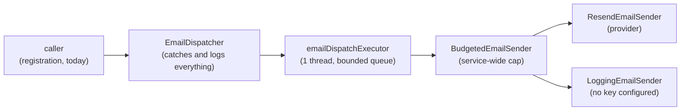

# Outbound email

<!-- reference-table:start -->
| Field | Value |
| ----- | ----- |
| ID | 000003 |
| Title | Outbound email |
| Description | How the EmailSender port, its Resend and logging adapters, the service-wide send budget, and off-request-thread dispatch work. |
| Tags | architecture, configuration, security |
| Created | 2026-08-03 |
| Updated | 2026-08-05 |
| Related | [000002](000002-authentication-and-tokens.md) |
<!-- reference-table:end -->

Everything this service sends to a mailbox goes through one narrow port, one
service-wide budget, and one thread. Today the only caller is registration —
the link that verifies a new account, and the notice sent to an address
somebody tried to register a second time (both described in [Authentication and
tokens](000002-authentication-and-tokens.md)) — but nothing here knows that.
The constraints below belong to the outbound channel, so anything added later
inherits them without having to remember to.

## The port and its adapters

`EmailSender` is a one-method port: `send(EmailMessage)`, where `EmailMessage`
is `to`, `subject`, `textBody` and `reference`. It is synchronous and blocking
by contract, and it throws rather than returning a status. Nothing in the
application calls it directly — `EmailDispatcher` is what absorbs both of those
properties, so no caller has to.

`EmailSenderFactory` chooses the adapter from whether
`zarlania.email.resend-api-key` is set. It is a class of its own rather than a
method on `EmailConfig` because the choice is not wiring: it encodes a rule
about how this service is allowed to run at all (below), and it is the piece
that changes when the provider does. `EmailConfig` is left holding bean
declarations only.

- **`ResendEmailSender`** posts to Resend's `/emails` over a `RestClient` aimed
  at `zarlania.email.resend-base-url`, which is configuration rather than a
  constant so a test can point the adapter at a stub and a different
  Resend-compatible endpoint needs no code change. Anything outside `2xx`
  throws, carrying the status and nothing else — Resend's error bodies hold no
  detail worth surfacing, and the failure ends up in a log line rather than in
  a response (see [Failures are logged, never
  returned](#failures-are-logged-never-returned)).
- **`LoggingEmailSender`** logs the message instead of sending it. This is what
  makes local development work with no provider account: the verification link
  is in the application log, so the flow can be completed by hand. It is the
  one place recipient and body reach a log at all, and it is selected only
  where no provider key is configured — see [What a failure line may
  contain](#what-a-failure-line-may-contain) for what the rest of the channel
  is allowed to record. Recipient, subject and body all originate from
  registration input, so each is stripped of line breaks before it reaches the
  logger — a crafted value could otherwise forge extra log lines.

**A missing key is a startup failure in production, not a fall back to
logging.** `EmailSenderFactory` throws if `resend-api-key` is blank while the
`production` profile is active. A deployment that silently stops sending real
verification emails — every new account stranded, no error anywhere — is worse
than one that refuses to start.

## The service-wide budget

The per-caller request throttles bound requests, not mail. Five registrations a
minute from one compliant address is roughly 7,200 messages a day against a
Resend free tier of about 100. With no cap of its own, this service would
discover the problem only when the provider's quota tripped: the provider
throws, the caller logs it, the endpoint still answers, and every legitimate
verification email after that point is silently lost.

`BudgetedEmailSender` decorates whichever adapter was chosen and spends from one
fixed key before delegating — 80 sends
(`zarlania.throttle.email-budget-limit`) per day (`email-budget-window`). One
key for the whole service, deliberately: this is a cap on total outbound
volume, not another per-caller limit. A rejected send throws
`EmailBudgetExhaustedException`, which is a distinct type from whatever an
adapter throws precisely so a caller can tell "this service stopped itself"
from "the provider broke".

It decorates the port rather than the one call site that sends mail today, so
the cap is a property of the channel. `EmailConfig`'s `emailSender` bean is
always the budgeted wrapper, and no bean exposes the adapter underneath it —
the only way to obtain a bare one is to call `EmailSenderFactory` directly.

The counting is done by the same `RateLimiter` the request throttles use
(described under [Throttling](000002-authentication-and-tokens.md#throttling)),
through its explicit-window overload. That overload exists for this: a daily
allowance expressed in the shared one-minute request window would cap the rate
while leaving the day's total unbounded.

## `EmailDispatcher`: the one way out

`EmailDispatcher.dispatch(EmailMessage)` is the only way mail leaves this
service. A caller composes a message and hands it over; everything else — which
thread the send happens on, which failures are possible, how each is reported —
belongs to the channel rather than to whatever triggered the send.

That split is deliberate. Those concerns amount to a `try`/`catch` over two
distinct exception types, a rejected-submission path, three log markers and two
static-analysis suppressions. Left at the call site, the second caller would
copy all of it and the copies would drift.

**`dispatch` never throws**, whatever goes wrong. A caller sends after its own
work has committed, so an exception could not undo anything and would only turn
a success into a 500.

### Off the request thread

`EmailConfig` builds a dedicated `emailDispatchExecutor`, and the dispatcher
submits to it rather than sending inline. **The reason is enumeration safety,
not throughput.** A provider round trip taken on a request thread would be
measurable in the response time, and on `/auth/resend` only one of the three
possible outcomes sends anything at all — so the timing would say which one
happened. That argument belongs to registration and is made in full under
[Enumeration
safety](000002-authentication-and-tokens.md#enumeration-safety-status-body-and-timing-all-have-to-match);
what this doc owns is the executor it produced.

One thread (`zarlania.email.dispatch-threads`, default 1), because the budget
already caps the service at 80 messages a day: there is no volume worth
parallelising, and each extra thread is heap a 512 MB instance has to find. It
is configuration rather than a constant because both halves of that reasoning
are sizing decisions — raise it with the instance size and the budget, not on
its own.

The queue is bounded at `zarlania.email.dispatch-queue-capacity` (200), so a
provider outage cannot grow it until the instance is OOM-killed. Submitting to
a full queue throws `RejectedExecutionException`, which the dispatcher catches
like any other failure — it is the one that happens before the sender is ever
reached. The capacity sits comfortably above the daily budget, so the budget —
not the queue — is what bounds outbound volume in practice.

On shutdown the executor drains rather than dropping: it stops accepting work,
runs what is already queued, and waits up to ten seconds for it. A send that
has reached the sender has already been counted against the budget, and every
message in the queue is somebody's verification link.

## Failures are logged, never returned

A failed send never changes an HTTP response. The reasoning is registration's
and is set out under [Enumeration
safety](000002-authentication-and-tokens.md#enumeration-safety-status-body-and-timing-all-have-to-match);
the consequence is the channel's, so the dispatcher — not any caller — is what
swallows every failure and logs it at `error` under a greppable marker.

The markers live with the dispatcher for the same reason, so a second caller
inherits them rather than copying the strings. They are kept distinct because
they call for different actions:

| Marker | Means | What to do |
| ------ | ----- | ---------- |
| `EMAIL_BUDGET_EXHAUSTED` | This service stopped itself | Re-derive the cap against the provider's real quota |
| `EMAIL_SEND_FAILED` | The provider refused or was unreachable | Check the provider's status and the API key |
| `EMAIL_QUEUE_FULL` | The message never reached the sender at all | The dispatch thread is stuck or the provider is timing out |

### What a failure line may contain

None of the three logs the message body — the verification mail carries the raw
token in it — and **none logs the recipient address either**, per `CLAUDE.md`'s
rule that a log records what happened and never who it was about.

What is logged instead is `EmailMessage.reference`: an opaque handle the
*caller* supplies. `RegistrationEmailListener` passes the account's id, so an
operator who needs the address can resolve it against the `users` table and
anyone else gets a UUID that means nothing. Same information, reachable only by
someone already entitled to it.

The reference has to come from the caller rather than be derived here, because
this package cannot ask who a message is for: `email` is topic infrastructure
with no dependency on `users`, and giving it one to satisfy a log line would
point that dependency backwards. So the constraint is stated on the record
instead — a reference must identify the *message* without identifying the
person, and an address or a name there puts back precisely what the field exists
to keep out.

Reference and subject are stripped of line breaks before they reach the logger,
since both are supplied by a calling domain and either could carry request input.

## Configuration

| Key | Default | What it controls |
| --- | ------- | ---------------- |
| `zarlania.email.from` | `no-reply@zarlania.com` | The `From` address on every message |
| `zarlania.email.resend-api-key` | empty | Provider key; empty selects the logging adapter, and is a startup failure in production |
| `zarlania.email.resend-base-url` | `https://api.resend.com` | The provider's API root |
| `zarlania.email.dispatch-threads` | `1` | How many sends may be in flight at once |
| `zarlania.email.dispatch-queue-capacity` | `200` | How many sends may queue before new ones are rejected |
| `zarlania.throttle.email-budget-limit` | `80` | Total sends allowed per window, service-wide |
| `zarlania.throttle.email-budget-window` | `P1D` | The budget's period |

`EMAIL_FROM`, `RESEND_API_KEY` and `RESEND_BASE_URL` are the environment
overrides for the first three; the rest are fixed in `application.yml`. The two
budget keys sit under `zarlania.throttle` rather than `zarlania.email` because
`ThrottleProperties` binds them, which is where they belong given the budget is
spent through the same `RateLimiter` the request throttles use.

## Manual setup

Two one-time steps outside this repository, both needed before production mail
reaches anyone:

1. **Resend account.** Create an account at Resend (free tier: roughly 3,000
   emails a month, about 100 a day — which is what the 80/day budget is sized
   against) and generate an API key.
2. **DNS.** Add Resend's SPF and DKIM records to the `zarlania.com` DNS zone,
   so mail from `EMAIL_FROM` is authenticated and does not land in spam.

The key goes in `RESEND_API_KEY` in the Render dashboard. `render.yaml`
declares it `sync: false`, so the blueprint reserves the slot but the value is
never committed. Leave it unset for local development: that is what selects
`LoggingEmailSender`, and the verification link then appears in the application
log.

## Tests

- [`ResendEmailSenderTest`](../../src/test/java/com/zarlania/api/email/ResendEmailSenderTest.java)
  — the request shape sent to Resend, and that any non-`2xx` throws.
- [`EmailSenderFactoryTest`](../../src/test/java/com/zarlania/api/email/EmailSenderFactoryTest.java)
  — which adapter is chosen for a given key and profile, that a key of only
  whitespace counts as unconfigured, and that a blank key in production fails
  startup rather than falling back to logging.
- [`EmailConfigTest`](../../src/test/java/com/zarlania/api/email/EmailConfigTest.java)
  — that whichever adapter is chosen is wrapped in the budget, and that the
  dispatch pool is bounded.
- [`LoggingEmailSenderTest`](../../src/test/java/com/zarlania/api/email/LoggingEmailSenderTest.java)
  — that the verification link is findable in the log, and that line breaks in
  crafted input cannot forge extra log lines.
- [`BudgetedEmailSenderTest`](../../src/test/java/com/zarlania/api/email/BudgetedEmailSenderTest.java)
  — that the delegate is never reached once the budget is spent, and that the
  allowance refills only after the window has actually passed.
