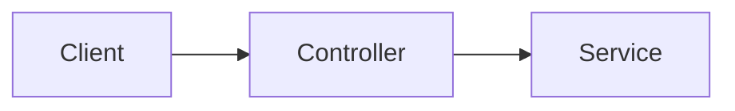

# Docs Directory and Reference Tooling Implementation Plan

> **For agentic workers:** REQUIRED SUB-SKILL: Use superpowers:subagent-driven-development (recommended) or superpowers:executing-plans to implement this plan task-by-task. Steps use checkbox (`- [ ]`) syntax for tracking.

**Goal:** Add a `docs/` directory (`ai-prompts`, `superpowers`, `references`) with a tested Python tooling package, Claude skills, a technical-writer agent, and CI gates — then replicate the identical structure to `zarlania-app`.

**Architecture:** Reference docs carry YAML frontmatter as the single source of truth; a shared Python package (`docs/tooling/docstooling`) renders and validates a human-readable "sister" table and a generated README index from that frontmatter. A thin `references_cli.py` binds the generic library to the reference doc-type via a `DocType` config, so a future ADR CLI can reuse the same library. Skills drive create/update/search and finalize through a technical-writer subagent; deterministic validation runs in CI.

**Tech Stack:** Python 3.11+, PyYAML, pytest + pytest-cov (≥80%), ruff (format + lint), mypy (strict); GitHub Actions (Lint workflow); markdownlint, yamllint.

## Global Constraints

- Spec: `docs/superpowers/specs/2026-07-23-docs-directory-design.md`. Tracking issue: `#15` (this repo).
- Reference doc filenames: `NNNNNN-<slug>.md`, id **6-digit zero-padded**, kebab-case slug.
- Reference frontmatter fields, in this order: `id, title, description, tags, created, updated, related`.
- `id` and `related` entries are **quoted strings** in YAML to preserve leading zeros.
- Frontmatter is the single source of truth; sister tables and the README index are generated and must validate as in-sync.
- Sister-table region marker: `reference-table`. README index region marker: `reference-index`. Regions are fenced by `<!-- <marker>:start -->` / `<!-- <marker>:end -->`.
- No reference doc may use a tag absent from `docs/references/_tags.md`. No reference doc may be missing from `docs/references/README.md`. Ids must be contiguous from `000001`, unique, no gaps.
- The technical-writer agent runs at authoring time only (never in CI).
- Reference docs are **not** ADRs and **not** OpenAPI (OpenAPI comes from Spring/springdoc; this exclusion note is backend-repo-only).
- `docs/superpowers/**` and `docs/ai-prompts/**` are excluded from markdownlint and yamllint. `docs/ai-prompts/*` is gitignored except `.gitkeep`.
- Repo workflow (CI-enforced): never commit to `master`; branch `15-docs-directory`; PR title `#15 chore: <desc>`; PR body contains `Closes #15`; apply a `major`/`minor`/`patch` label. Python linter versions are pinned (bumped by hand, like the repo's other linters). GitHub Actions are SHA-pinned with a version comment.
- Work happens on branch `15-docs-directory` (already created). Commit after every task.

---

### Task 1: Tooling scaffold and `DocType` config

**Files:**
- Create: `docs/tooling/pyproject.toml`
- Create: `docs/tooling/docstooling/__init__.py`
- Create: `docs/tooling/docstooling/config.py`
- Create: `docs/tooling/tests/__init__.py`
- Create: `docs/tooling/tests/conftest.py`
- Test: `docs/tooling/tests/test_config.py`

**Interfaces:**
- Produces: `DocType` frozen dataclass with fields `name:str, root:Path, id_width:int, table_marker:str, index_marker:str, template_path:Path, tags_path:Path, readme_path:Path`; `reference_doctype(root: Path) -> DocType`; module constant `REFERENCE: DocType`.
- Produces (test fixture): `conftest.py::reference_root(tmp_path) -> Path` building a minimal valid references dir.

- [ ] **Step 1: Write `pyproject.toml`**

```toml
[project]
name = "docstooling"
version = "0.0.0"
description = "Tooling for Zarlania reference documentation."
requires-python = ">=3.11"
dependencies = ["pyyaml==6.0.3"]

[project.optional-dependencies]
dev = [
  "ruff==0.14.4",
  "mypy==1.13.0",
  "pytest==8.3.4",
  "pytest-cov==6.0.0",
  "types-PyYAML==6.0.12.20240917",
]

[tool.setuptools]
py-modules = ["references_cli"]
packages = ["docstooling"]

[tool.ruff]
line-length = 100
target-version = "py311"

[tool.ruff.lint]
select = ["E", "F", "I", "UP", "B", "SIM"]

[tool.mypy]
strict = true
files = ["docstooling", "references_cli.py"]

[tool.pytest.ini_options]
addopts = "--cov=docstooling --cov=references_cli --cov-report=term-missing --cov-fail-under=80"
testpaths = ["tests"]
```

- [ ] **Step 2: Write `docstooling/__init__.py`** (empty package marker)

```python
"""Shared tooling for Zarlania documentation doc-types (references today, ADRs later)."""
```

- [ ] **Step 3: Write `docstooling/config.py`**

```python
"""Doc-type configuration.

A DocType parameterizes the generic library for one kind of document. The
reference doc-type is defined here; a future ADR doc-type will add its own
factory and reuse the same library.
"""

from __future__ import annotations

from dataclasses import dataclass
from pathlib import Path


@dataclass(frozen=True)
class DocType:
    name: str
    root: Path
    id_width: int
    table_marker: str
    index_marker: str
    template_path: Path
    tags_path: Path
    readme_path: Path


def reference_doctype(root: Path) -> DocType:
    """Build the reference DocType rooted at ``root`` (e.g. ``docs/references``)."""
    return DocType(
        name="reference",
        root=root,
        id_width=6,
        table_marker="reference-table",
        index_marker="reference-index",
        template_path=root / "_template.md",
        tags_path=root / "_tags.md",
        readme_path=root / "README.md",
    )


# docs/tooling/docstooling/config.py -> parents[2] is docs/, so docs/references.
_DEFAULT_ROOT = Path(__file__).resolve().parents[2] / "references"
REFERENCE = reference_doctype(_DEFAULT_ROOT)
```

- [ ] **Step 4: Write `tests/__init__.py`** (empty file)

- [ ] **Step 5: Write `tests/conftest.py`** (shared fixture used by later tasks)

```python
"""Shared fixtures: a minimal, valid references directory in a tmp path."""

from __future__ import annotations

from pathlib import Path

import pytest

from docstooling.config import DocType, reference_doctype

_TAGS = """# Reference tags

<!-- reference-tags -->
| Tag | Description |
| --- | ----------- |
| http | HTTP request/response handling. |
| controllers | Spring MVC controllers. |
"""

_README = """# References

<!-- reference-index:start -->
<!-- reference-index:end -->
"""

_TEMPLATE = """---
id: "000000"
title: Title here
description: One-line description.
tags: []
created: 2026-01-01
updated: 2026-01-01
related: []
---

# Title here

<!-- reference-table:start -->
<!-- reference-table:end -->

Documentation prose goes here.
"""


def write_doc(root: Path, doc_id: str, slug: str, *, title: str, tags: list[str],
              related: list[str], created: str = "2026-07-23",
              updated: str = "2026-07-23") -> Path:
    """Write a reference doc with an (empty) table region for tests to sync/validate."""
    tags_yaml = "[" + ", ".join(tags) + "]"
    related_yaml = "[" + ", ".join(f'"{r}"' for r in related) + "]"
    path = root / f"{doc_id}-{slug}.md"
    path.write_text(
        f'---\n'
        f'id: "{doc_id}"\n'
        f"title: {title}\n"
        f"description: Desc for {title}.\n"
        f"tags: {tags_yaml}\n"
        f"created: {created}\n"
        f"updated: {updated}\n"
        f"related: {related_yaml}\n"
        f"---\n\n"
        f"# {title}\n\n"
        f"<!-- reference-table:start -->\n<!-- reference-table:end -->\n\n"
        f"Body of {title}.\n",
        encoding="utf-8",
    )
    return path


@pytest.fixture
def reference_root(tmp_path: Path) -> Path:
    root = tmp_path / "references"
    root.mkdir()
    (root / "_tags.md").write_text(_TAGS, encoding="utf-8")
    (root / "README.md").write_text(_README, encoding="utf-8")
    (root / "_template.md").write_text(_TEMPLATE, encoding="utf-8")
    return root


@pytest.fixture
def reference_dt(reference_root: Path) -> DocType:
    return reference_doctype(reference_root)
```

- [ ] **Step 6: Write `tests/test_config.py`**

```python
from pathlib import Path

from docstooling.config import REFERENCE, reference_doctype


def test_reference_doctype_derives_paths_from_root():
    dt = reference_doctype(Path("/x/references"))
    assert dt.id_width == 6
    assert dt.table_marker == "reference-table"
    assert dt.index_marker == "reference-index"
    assert dt.tags_path == Path("/x/references/_tags.md")
    assert dt.readme_path == Path("/x/references/README.md")
    assert dt.template_path == Path("/x/references/_template.md")


def test_default_reference_root_points_at_docs_references():
    assert REFERENCE.root.name == "references"
    assert REFERENCE.root.parent.name == "docs"
```

- [ ] **Step 7: Install and run**

Run: `cd docs/tooling && pip install -e '.[dev]' && pytest tests/test_config.py -v`
Expected: 2 passed. (Coverage gate may warn on this single file; that is fine until later tasks.)

- [ ] **Step 8: Commit**

```bash
git add docs/tooling
git commit -m "chore: scaffold docs tooling package and DocType config"
```

---

### Task 2: Frontmatter parsing and rendering

**Files:**
- Create: `docs/tooling/docstooling/frontmatter.py`
- Test: `docs/tooling/tests/test_frontmatter.py`

**Interfaces:**
- Produces: `FrontmatterError(ValueError)`; `split_frontmatter(text: str) -> tuple[dict, str]` returning `(data, body)`; `render_frontmatter(data: dict) -> str` returning a `---`-delimited block ending in a newline.

- [ ] **Step 1: Write `tests/test_frontmatter.py`**

```python
import pytest

from docstooling.frontmatter import (
    FrontmatterError,
    render_frontmatter,
    split_frontmatter,
)


def test_split_returns_mapping_and_body():
    text = '---\nid: "000001"\ntitle: Hello\n---\n\n# Hello\n\nBody.\n'
    data, body = split_frontmatter(text)
    assert data == {"id": "000001", "title": "Hello"}
    assert body == "\n# Hello\n\nBody.\n"


def test_split_rejects_missing_opening_delimiter():
    with pytest.raises(FrontmatterError):
        split_frontmatter("# No frontmatter\n")


def test_split_rejects_unterminated_frontmatter():
    with pytest.raises(FrontmatterError):
        split_frontmatter("---\nid: x\n")


def test_split_rejects_non_mapping():
    with pytest.raises(FrontmatterError):
        split_frontmatter("---\n- just\n- a\n- list\n---\nbody\n")


def test_render_round_trips_and_preserves_order():
    data = {"id": "000001", "title": "Hello", "tags": ["http"]}
    rendered = render_frontmatter(data)
    assert rendered.startswith("---\n")
    assert rendered.endswith("---\n")
    back, _ = split_frontmatter(rendered + "\nbody\n")
    assert back == data
    assert list(back.keys()) == ["id", "title", "tags"]
```

- [ ] **Step 2: Run to verify it fails**

Run: `cd docs/tooling && pytest tests/test_frontmatter.py -v`
Expected: FAIL — `ModuleNotFoundError: docstooling.frontmatter`.

- [ ] **Step 3: Write `docstooling/frontmatter.py`**

```python
"""Parse and render the YAML frontmatter block of a markdown document."""

from __future__ import annotations

from typing import Any

import yaml

DELIMITER = "---"


class FrontmatterError(ValueError):
    """Raised when a document's frontmatter is missing or malformed."""


def split_frontmatter(text: str) -> tuple[dict[str, Any], str]:
    """Return ``(frontmatter, body)``.

    The document must start with a ``---`` line, contain a YAML mapping, and a
    closing ``---`` line. Everything after the closing delimiter is the body.
    """
    if not text.startswith(DELIMITER + "\n"):
        raise FrontmatterError("document does not start with '---' frontmatter")
    lines = text.split("\n")
    for i in range(1, len(lines)):
        if lines[i] == DELIMITER:
            raw = "\n".join(lines[1:i])
            body = "\n".join(lines[i + 1 :])
            data = yaml.safe_load(raw) or {}
            if not isinstance(data, dict):
                raise FrontmatterError("frontmatter is not a mapping")
            return data, body
    raise FrontmatterError("frontmatter closing '---' not found")


def render_frontmatter(data: dict[str, Any]) -> str:
    """Render a frontmatter mapping to a ``---``-delimited block (key order kept)."""
    dumped = yaml.safe_dump(data, sort_keys=False, allow_unicode=True).rstrip("\n")
    return f"{DELIMITER}\n{dumped}\n{DELIMITER}\n"
```

- [ ] **Step 4: Run to verify it passes**

Run: `cd docs/tooling && pytest tests/test_frontmatter.py -v`
Expected: 5 passed.

- [ ] **Step 5: Commit**

```bash
git add docs/tooling/docstooling/frontmatter.py docs/tooling/tests/test_frontmatter.py
git commit -m "feat: parse and render reference doc frontmatter"
```

---

### Task 3: Document model and loading

**Files:**
- Create: `docs/tooling/docstooling/document.py`
- Test: `docs/tooling/tests/test_document.py`

**Interfaces:**
- Consumes: `split_frontmatter`, `FrontmatterError` (Task 2).
- Produces: `REQUIRED_FIELDS: tuple[str, ...]`; `Document` dataclass with `id, title, description, tags:list[str], created, updated, related:list[str], body:str, path:Path`; `load_document(path: Path) -> Document`; `load_all(root: Path) -> list[Document]` (sorted by id, only files matching `[0-9]*.md`).

- [ ] **Step 1: Write `tests/test_document.py`**

```python
import pytest

from docstooling.document import load_all, load_document
from docstooling.frontmatter import FrontmatterError
from tests.conftest import write_doc


def test_load_document_reads_all_fields(reference_root):
    path = write_doc(reference_root, "000001", "hello", title="Hello",
                     tags=["http"], related=["000002"])
    doc = load_document(path)
    assert doc.id == "000001"
    assert doc.title == "Hello"
    assert doc.tags == ["http"]
    assert doc.related == ["000002"]
    assert "Body of Hello." in doc.body


def test_load_document_rejects_missing_field(reference_root):
    path = reference_root / "000001-bad.md"
    path.write_text('---\nid: "000001"\ntitle: X\n---\n\n# X\n', encoding="utf-8")
    with pytest.raises(FrontmatterError):
        load_document(path)


def test_load_all_sorted_by_id_and_skips_meta_files(reference_root):
    write_doc(reference_root, "000002", "b", title="B", tags=[], related=[])
    write_doc(reference_root, "000001", "a", title="A", tags=[], related=[])
    docs = load_all(reference_root)
    assert [d.id for d in docs] == ["000001", "000002"]  # _tags/_template/README skipped
```

- [ ] **Step 2: Run to verify it fails**

Run: `cd docs/tooling && pytest tests/test_document.py -v`
Expected: FAIL — `ModuleNotFoundError: docstooling.document`.

- [ ] **Step 3: Write `docstooling/document.py`**

```python
"""The Document model and filesystem loading."""

from __future__ import annotations

from dataclasses import dataclass
from pathlib import Path

from .frontmatter import FrontmatterError, split_frontmatter

REQUIRED_FIELDS: tuple[str, ...] = (
    "id",
    "title",
    "description",
    "tags",
    "created",
    "updated",
    "related",
)


@dataclass
class Document:
    id: str
    title: str
    description: str
    tags: list[str]
    created: str
    updated: str
    related: list[str]
    body: str
    path: Path


def load_document(path: Path) -> Document:
    data, body = split_frontmatter(path.read_text(encoding="utf-8"))
    missing = [f for f in REQUIRED_FIELDS if f not in data]
    if missing:
        raise FrontmatterError(f"{path.name}: missing frontmatter fields: {', '.join(missing)}")
    return Document(
        id=str(data["id"]),
        title=str(data["title"]),
        description=str(data["description"]),
        tags=[str(t) for t in (data["tags"] or [])],
        created=str(data["created"]),
        updated=str(data["updated"]),
        related=[str(r) for r in (data["related"] or [])],
        body=body,
        path=path,
    )


def load_all(root: Path) -> list[Document]:
    """Load every reference doc (files whose name starts with a digit), sorted by id."""
    docs = [load_document(p) for p in root.glob("[0-9]*.md")]
    return sorted(docs, key=lambda d: d.id)
```

- [ ] **Step 4: Run to verify it passes**

Run: `cd docs/tooling && pytest tests/test_document.py -v`
Expected: 3 passed.

- [ ] **Step 5: Commit**

```bash
git add docs/tooling/docstooling/document.py docs/tooling/tests/test_document.py
git commit -m "feat: load reference documents from disk"
```

---

### Task 4: Marker region replace/extract

**Files:**
- Create: `docs/tooling/docstooling/markers.py`
- Test: `docs/tooling/tests/test_markers.py`

**Interfaces:**
- Produces: `MarkerError(ValueError)`; `replace_region(text: str, name: str, content: str) -> str` (replaces text between `<!-- name:start -->` and `<!-- name:end -->`); `extract_region(text: str, name: str) -> str` (returns the inner content, stripped of surrounding newlines).

- [ ] **Step 1: Write `tests/test_markers.py`**

```python
import pytest

from docstooling.markers import MarkerError, extract_region, replace_region

DOC = "before\n<!-- t:start -->\nOLD\n<!-- t:end -->\nafter\n"


def test_replace_region_swaps_inner_content():
    out = replace_region(DOC, "t", "NEW")
    assert "<!-- t:start -->\nNEW\n<!-- t:end -->" in out
    assert "OLD" not in out
    assert out.startswith("before\n")
    assert out.endswith("after\n")


def test_replace_region_is_idempotent():
    once = replace_region(DOC, "t", "NEW")
    assert replace_region(once, "t", "NEW") == once


def test_extract_region_returns_inner():
    assert extract_region(DOC, "t") == "OLD"


def test_missing_markers_raise():
    with pytest.raises(MarkerError):
        replace_region("no markers", "t", "x")
    with pytest.raises(MarkerError):
        extract_region("no markers", "t")
```

- [ ] **Step 2: Run to verify it fails**

Run: `cd docs/tooling && pytest tests/test_markers.py -v`
Expected: FAIL — `ModuleNotFoundError: docstooling.markers`.

- [ ] **Step 3: Write `docstooling/markers.py`**

```python
"""Replace and extract HTML-comment-delimited regions in markdown."""

from __future__ import annotations


class MarkerError(ValueError):
    """Raised when a named region's markers are missing or malformed."""


def _markers(name: str) -> tuple[str, str]:
    return f"<!-- {name}:start -->", f"<!-- {name}:end -->"


def _bounds(text: str, name: str) -> tuple[str, int, str, int]:
    start, end = _markers(name)
    si = text.find(start)
    ei = text.find(end)
    if si == -1 or ei == -1 or ei < si:
        raise MarkerError(f"region '{name}' markers not found or malformed")
    return start, si, end, ei


def replace_region(text: str, name: str, content: str) -> str:
    """Replace the content between the start and end markers with ``content``."""
    start, si, _end, ei = _bounds(text, name)
    prefix = text[: si + len(start)]
    suffix = text[ei:]
    return f"{prefix}\n{content}\n{suffix}"


def extract_region(text: str, name: str) -> str:
    """Return the current content between the markers, stripped of edge newlines."""
    start, si, _end, ei = _bounds(text, name)
    return text[si + len(start) : ei].strip("\n")
```

- [ ] **Step 4: Run to verify it passes**

Run: `cd docs/tooling && pytest tests/test_markers.py -v`
Expected: 4 passed.

- [ ] **Step 5: Commit**

```bash
git add docs/tooling/docstooling/markers.py docs/tooling/tests/test_markers.py
git commit -m "feat: add marker region replace/extract"
```

---

### Task 5: Sister-table rendering

**Files:**
- Create: `docs/tooling/docstooling/table.py`
- Test: `docs/tooling/tests/test_table.py`

**Interfaces:**
- Consumes: `Document` (Task 3).
- Produces: `render_table(doc: Document, by_id: dict[str, Document]) -> str` returning the markdown table body (no markers). `related` renders as `[id](filename)` links when the target exists, else the bare id; empty lists render as `—`.

- [ ] **Step 1: Write `tests/test_table.py`**

```python
from docstooling.document import load_all
from docstooling.table import render_table
from tests.conftest import write_doc


def test_render_table_includes_all_fields_and_related_link(reference_root):
    write_doc(reference_root, "000002", "target", title="Target", tags=[], related=[])
    write_doc(reference_root, "000001", "hello", title="Hello",
              tags=["http", "controllers"], related=["000002"])
    docs = load_all(reference_root)
    by_id = {d.id: d for d in docs}
    table = render_table(by_id["000001"], by_id)
    assert "| ID | 000001 |" in table
    assert "| Title | Hello |" in table
    assert "| Tags | http, controllers |" in table
    assert "| Related | [000002](000002-target.md) |" in table


def test_render_table_uses_dash_for_empty_lists(reference_root):
    write_doc(reference_root, "000001", "hello", title="Hello", tags=[], related=[])
    docs = load_all(reference_root)
    table = render_table(docs[0], {d.id: d for d in docs})
    assert "| Tags | — |" in table
    assert "| Related | — |" in table
```

- [ ] **Step 2: Run to verify it fails**

Run: `cd docs/tooling && pytest tests/test_table.py -v`
Expected: FAIL — `ModuleNotFoundError: docstooling.table`.

- [ ] **Step 3: Write `docstooling/table.py`**

```python
"""Render a reference doc's human-readable sister table from its fields."""

from __future__ import annotations

from .document import Document

_DASH = "—"


def _format_related(related: list[str], by_id: dict[str, Document]) -> str:
    if not related:
        return _DASH
    parts = []
    for rid in related:
        target = by_id.get(rid)
        parts.append(f"[{rid}]({target.path.name})" if target else rid)
    return ", ".join(parts)


def render_table(doc: Document, by_id: dict[str, Document]) -> str:
    tags = ", ".join(doc.tags) if doc.tags else _DASH
    rows = [
        "| Field | Value |",
        "| ----- | ----- |",
        f"| ID | {doc.id} |",
        f"| Title | {doc.title} |",
        f"| Description | {doc.description} |",
        f"| Tags | {tags} |",
        f"| Created | {doc.created} |",
        f"| Updated | {doc.updated} |",
        f"| Related | {_format_related(doc.related, by_id)} |",
    ]
    return "\n".join(rows)
```

- [ ] **Step 4: Run to verify it passes**

Run: `cd docs/tooling && pytest tests/test_table.py -v`
Expected: 2 passed.

- [ ] **Step 5: Commit**

```bash
git add docs/tooling/docstooling/table.py docs/tooling/tests/test_table.py
git commit -m "feat: render reference sister table"
```

---

### Task 6: README index rendering

**Files:**
- Create: `docs/tooling/docstooling/index.py`
- Test: `docs/tooling/tests/test_index.py`

**Interfaces:**
- Consumes: `Document` (Task 3).
- Produces: `render_index(docs: list[Document]) -> str` — a markdown table with header `| ID | Title | Description | Tags |`, one row per doc sorted by id, id linking to the filename.

- [ ] **Step 1: Write `tests/test_index.py`**

```python
from docstooling.document import load_all
from docstooling.index import render_index
from tests.conftest import write_doc


def test_render_index_one_row_per_doc_sorted(reference_root):
    write_doc(reference_root, "000002", "beta", title="Beta", tags=["http"], related=[])
    write_doc(reference_root, "000001", "alpha", title="Alpha", tags=[], related=[])
    out = render_index(load_all(reference_root))
    lines = out.splitlines()
    assert lines[0] == "| ID | Title | Description | Tags |"
    assert lines[2].startswith("| [000001](000001-alpha.md) | Alpha |")
    assert lines[3].startswith("| [000002](000002-beta.md) | Beta |")
    assert "| http |" in lines[3]
```

- [ ] **Step 2: Run to verify it fails**

Run: `cd docs/tooling && pytest tests/test_index.py -v`
Expected: FAIL — `ModuleNotFoundError: docstooling.index`.

- [ ] **Step 3: Write `docstooling/index.py`**

```python
"""Render the README index table from all reference documents."""

from __future__ import annotations

from .document import Document

_DASH = "—"


def render_index(docs: list[Document]) -> str:
    rows = [
        "| ID | Title | Description | Tags |",
        "| -- | ----- | ----------- | ---- |",
    ]
    for doc in sorted(docs, key=lambda d: d.id):
        tags = ", ".join(doc.tags) if doc.tags else _DASH
        rows.append(
            f"| [{doc.id}]({doc.path.name}) | {doc.title} | {doc.description} | {tags} |"
        )
    return "\n".join(rows)
```

- [ ] **Step 4: Run to verify it passes**

Run: `cd docs/tooling && pytest tests/test_index.py -v`
Expected: 1 passed.

- [ ] **Step 5: Commit**

```bash
git add docs/tooling/docstooling/index.py docs/tooling/tests/test_index.py
git commit -m "feat: render reference README index"
```

---

### Task 7: Id allocation and sequence validation

**Files:**
- Create: `docs/tooling/docstooling/sequence.py`
- Test: `docs/tooling/tests/test_sequence.py`

**Interfaces:**
- Consumes: `Document` (Task 3).
- Produces: `next_id(docs: list[Document], width: int) -> str`; `validate_sequence(docs: list[Document], width: int) -> list[str]` (returns human-readable error strings; empty means valid).

- [ ] **Step 1: Write `tests/test_sequence.py`**

```python
from dataclasses import replace
from pathlib import Path

from docstooling.document import Document
from docstooling.sequence import next_id, validate_sequence


def _doc(doc_id: str) -> Document:
    return Document(id=doc_id, title="t", description="d", tags=[], created="c",
                    updated="u", related=[], body="", path=Path(f"{doc_id}-x.md"))


def test_next_id_starts_at_one_when_empty():
    assert next_id([], 6) == "000001"


def test_next_id_increments_max():
    assert next_id([_doc("000001"), _doc("000004")], 6) == "000005"


def test_validate_sequence_accepts_contiguous():
    assert validate_sequence([_doc("000001"), _doc("000002")], 6) == []


def test_validate_sequence_flags_gap():
    errors = validate_sequence([_doc("000001"), _doc("000003")], 6)
    assert any("gap" in e for e in errors)


def test_validate_sequence_flags_duplicate():
    errors = validate_sequence([_doc("000001"), _doc("000001")], 6)
    assert any("duplicate" in e for e in errors)


def test_validate_sequence_flags_bad_width():
    errors = validate_sequence([replace(_doc("1"), id="1")], 6)
    assert any("6 digits" in e for e in errors)
```

- [ ] **Step 2: Run to verify it fails**

Run: `cd docs/tooling && pytest tests/test_sequence.py -v`
Expected: FAIL — `ModuleNotFoundError: docstooling.sequence`.

- [ ] **Step 3: Write `docstooling/sequence.py`**

```python
"""Allocate the next id and validate the id sequence is contiguous and unique."""

from __future__ import annotations

from .document import Document


def next_id(docs: list[Document], width: int) -> str:
    numbers = [int(d.id) for d in docs if d.id.isdigit()]
    nxt = max(numbers) + 1 if numbers else 1
    return str(nxt).zfill(width)


def validate_sequence(docs: list[Document], width: int) -> list[str]:
    errors: list[str] = []
    for doc in docs:
        if len(doc.id) != width or not doc.id.isdigit():
            errors.append(f"{doc.path.name}: id '{doc.id}' must be {width} digits")

    numbers = sorted(int(d.id) for d in docs if d.id.isdigit())
    seen: set[int] = set()
    for number in numbers:
        if number in seen:
            errors.append(f"duplicate id: {str(number).zfill(width)}")
        seen.add(number)

    for expected, actual in enumerate(sorted(seen), start=1):
        if expected != actual:
            errors.append(
                f"id sequence gap: expected {str(expected).zfill(width)}, "
                f"found {str(actual).zfill(width)}"
            )
            break
    return errors
```

- [ ] **Step 4: Run to verify it passes**

Run: `cd docs/tooling && pytest tests/test_sequence.py -v`
Expected: 6 passed.

- [ ] **Step 5: Commit**

```bash
git add docs/tooling/docstooling/sequence.py docs/tooling/tests/test_sequence.py
git commit -m "feat: allocate ids and validate the id sequence"
```

---

### Task 8: Tag registry loading

**Files:**
- Create: `docs/tooling/docstooling/tags.py`
- Test: `docs/tooling/tests/test_tags.py`

**Interfaces:**
- Produces: `load_tags(path: Path) -> set[str]` — parse `_tags.md`, returning the set of tag names from the first column of its table (skipping the header and separator rows).

- [ ] **Step 1: Write `tests/test_tags.py`**

```python
from docstooling.tags import load_tags


def test_load_tags_reads_first_column(reference_root):
    tags = load_tags(reference_root / "_tags.md")
    assert tags == {"http", "controllers"}
```

- [ ] **Step 2: Run to verify it fails**

Run: `cd docs/tooling && pytest tests/test_tags.py -v`
Expected: FAIL — `ModuleNotFoundError: docstooling.tags`.

- [ ] **Step 3: Write `docstooling/tags.py`**

```python
"""Load the tag registry (the first column of the _tags.md table)."""

from __future__ import annotations

import re
from pathlib import Path

_ROW = re.compile(r"^\|\s*`?([A-Za-z0-9-]+)`?\s*\|")


def load_tags(path: Path) -> set[str]:
    tags: set[str] = set()
    for line in path.read_text(encoding="utf-8").splitlines():
        match = _ROW.match(line)
        if not match:
            continue
        token = match.group(1)
        if token.lower() == "tag" or set(token) == {"-"}:
            continue  # header cell or separator row
        tags.add(token)
    return tags
```

- [ ] **Step 4: Run to verify it passes**

Run: `cd docs/tooling && pytest tests/test_tags.py -v`
Expected: 1 passed.

- [ ] **Step 5: Commit**

```bash
git add docs/tooling/docstooling/tags.py docs/tooling/tests/test_tags.py
git commit -m "feat: load tag registry from _tags.md"
```

---

### Task 9: Full validation

**Files:**
- Create: `docs/tooling/docstooling/validate.py`
- Test: `docs/tooling/tests/test_validate.py`

**Interfaces:**
- Consumes: `DocType` (Task 1), `load_all` (Task 3), `extract_region` (Task 4), `render_table` (Task 5), `render_index` (Task 6), `validate_sequence` (Task 7), `load_tags` (Task 8).
- Produces: `validate(dt: DocType) -> list[str]` — aggregate error strings; empty means valid. Checks: id sequence; filename starts with `<id>-`; every tag is registered; every `related` id exists; each doc's table region matches `render_table`; the README index region matches `render_index`.

- [ ] **Step 1: Write `tests/test_validate.py`**

```python
from docstooling.sync import sync  # Task 10; import here so validate tests use synced fixtures
from docstooling.validate import validate
from tests.conftest import write_doc


def _seed(root):
    write_doc(root, "000001", "hello", title="Hello", tags=["http"], related=["000002"])
    write_doc(root, "000002", "world", title="World", tags=["controllers"], related=[])


def test_validate_passes_after_sync(reference_dt):
    _seed(reference_dt.root)
    sync(reference_dt)
    assert validate(reference_dt) == []


def test_validate_flags_unknown_tag(reference_dt):
    write_doc(reference_dt.root, "000001", "hello", title="Hello",
              tags=["nope"], related=[])
    sync(reference_dt)
    assert any("unknown tag 'nope'" in e for e in validate(reference_dt))


def test_validate_flags_missing_related(reference_dt):
    write_doc(reference_dt.root, "000001", "hello", title="Hello",
              tags=["http"], related=["000099"])
    sync(reference_dt)
    assert any("related id '000099'" in e for e in validate(reference_dt))


def test_validate_flags_drifted_table(reference_dt):
    _seed(reference_dt.root)
    sync(reference_dt)
    doc = reference_dt.root / "000001-hello.md"
    doc.write_text(doc.read_text().replace("| Title | Hello |", "| Title | Tampered |"))
    assert any("table out of sync" in e for e in validate(reference_dt))


def test_validate_flags_filename_id_mismatch(reference_dt):
    write_doc(reference_dt.root, "000001", "hello", title="Hello", tags=["http"], related=[])
    (reference_dt.root / "000001-hello.md").rename(reference_dt.root / "000002-hello.md")
    sync(reference_dt)
    # after rename the file's frontmatter id (000001) disagrees with filename (000002-)
    assert any("filename must start" in e for e in validate(reference_dt))
```

- [ ] **Step 2: Run to verify it fails**

Run: `cd docs/tooling && pytest tests/test_validate.py -v`
Expected: FAIL — `ModuleNotFoundError: docstooling.validate` (and `docstooling.sync` until Task 10; that is expected — this test is completed by Task 10).

- [ ] **Step 3: Write `docstooling/validate.py`**

```python
"""Aggregate structural validation for a doc-type."""

from __future__ import annotations

from .config import DocType
from .document import load_all
from .index import render_index
from .markers import MarkerError, extract_region
from .sequence import validate_sequence
from .table import render_table
from .tags import load_tags


def validate(dt: DocType) -> list[str]:
    docs = load_all(dt.root)
    by_id = {d.id: d for d in docs}
    errors: list[str] = list(validate_sequence(docs, dt.id_width))

    for doc in docs:
        if not doc.path.name.startswith(f"{doc.id}-"):
            errors.append(f"{doc.path.name}: filename must start with id '{doc.id}-'")

    known = load_tags(dt.tags_path)
    for doc in docs:
        for tag in doc.tags:
            if tag not in known:
                errors.append(
                    f"{doc.path.name}: unknown tag '{tag}' (not in {dt.tags_path.name})"
                )
        for rid in doc.related:
            if rid not in by_id:
                errors.append(f"{doc.path.name}: related id '{rid}' does not exist")

    for doc in docs:
        try:
            current = extract_region(doc.path.read_text(encoding="utf-8"), dt.table_marker)
        except MarkerError:
            errors.append(f"{doc.path.name}: missing '{dt.table_marker}' markers")
            continue
        if current != render_table(doc, by_id):
            errors.append(f"{doc.path.name}: table out of sync (run sync)")

    try:
        index_now = extract_region(dt.readme_path.read_text(encoding="utf-8"), dt.index_marker)
        if index_now != render_index(docs):
            errors.append(f"{dt.readme_path.name}: index out of sync (run sync)")
    except MarkerError:
        errors.append(f"{dt.readme_path.name}: missing '{dt.index_marker}' markers")

    return errors
```

- [ ] **Step 4: Defer running** until Task 10 provides `sync` (the test imports it). Do not commit a failing state; continue to Task 10, then run both test files together.

---

### Task 10: `sync` and `create` commands

**Files:**
- Create: `docs/tooling/docstooling/sync.py`
- Create: `docs/tooling/docstooling/create.py`
- Test: `docs/tooling/tests/test_sync.py`
- Test: `docs/tooling/tests/test_create.py`

**Interfaces:**
- Consumes: `DocType` (1), `load_all`/`Document` (3), `replace_region` (4), `render_table` (5), `render_index` (6), `next_id` (7), `render_frontmatter` (2), `split_frontmatter` (2).
- Produces: `sync(dt: DocType) -> None` (regenerate every sister table and the README index, in place, idempotently); `slugify(title: str) -> str`; `create(dt: DocType, *, title: str, description: str, tags: list[str], related: list[str], today: str) -> Path` (allocate next id, scaffold from `_template.md`, write, then `sync`).

- [ ] **Step 1: Write `docstooling/sync.py`**

```python
"""Regenerate sister tables and the README index from frontmatter."""

from __future__ import annotations

from .config import DocType
from .document import load_all
from .index import render_index
from .markers import replace_region
from .table import render_table


def sync(dt: DocType) -> None:
    docs = load_all(dt.root)
    by_id = {d.id: d for d in docs}
    for doc in docs:
        text = doc.path.read_text(encoding="utf-8")
        updated = replace_region(text, dt.table_marker, render_table(doc, by_id))
        if updated != text:
            doc.path.write_text(updated, encoding="utf-8")

    readme = dt.readme_path.read_text(encoding="utf-8")
    updated_readme = replace_region(readme, dt.index_marker, render_index(docs))
    if updated_readme != readme:
        dt.readme_path.write_text(updated_readme, encoding="utf-8")
```

- [ ] **Step 2: Write `docstooling/create.py`**

```python
"""Scaffold a new reference document from the template."""

from __future__ import annotations

import re
from pathlib import Path

from .config import DocType
from .document import load_all
from .frontmatter import render_frontmatter, split_frontmatter
from .markers import replace_region
from .sequence import next_id
from .sync import sync

_NON_SLUG = re.compile(r"[^a-z0-9]+")


def slugify(title: str) -> str:
    return _NON_SLUG.sub("-", title.lower()).strip("-")


def _scaffold_body(dt: DocType, title: str) -> str:
    _fm, body = split_frontmatter(dt.template_path.read_text(encoding="utf-8"))
    body = re.sub(r"^# .*$", f"# {title}", body, count=1, flags=re.MULTILINE)
    body = replace_region(body, dt.table_marker, "")
    return body.lstrip("\n")


def create(
    dt: DocType,
    *,
    title: str,
    description: str,
    tags: list[str],
    related: list[str],
    today: str,
) -> Path:
    docs = load_all(dt.root)
    new_id = next_id(docs, dt.id_width)
    path = dt.root / f"{new_id}-{slugify(title)}.md"
    frontmatter = render_frontmatter(
        {
            "id": new_id,
            "title": title,
            "description": description,
            "tags": tags,
            "created": today,
            "updated": today,
            "related": related,
        }
    )
    path.write_text(f"{frontmatter}\n{_scaffold_body(dt, title)}", encoding="utf-8")
    sync(dt)
    return path
```

- [ ] **Step 3: Write `tests/test_sync.py`**

```python
from docstooling.document import load_all
from docstooling.markers import extract_region
from docstooling.sync import sync
from docstooling.table import render_table
from tests.conftest import write_doc


def test_sync_fills_table_and_index(reference_dt):
    write_doc(reference_dt.root, "000001", "hello", title="Hello", tags=["http"], related=[])
    sync(reference_dt)
    docs = load_all(reference_dt.root)
    body = docs[0].path.read_text()
    assert "| Title | Hello |" in extract_region(body, "reference-table")
    readme = reference_dt.readme_path.read_text()
    assert "[000001](000001-hello.md)" in extract_region(readme, "reference-index")


def test_sync_is_idempotent(reference_dt):
    write_doc(reference_dt.root, "000001", "hello", title="Hello", tags=["http"], related=[])
    sync(reference_dt)
    first = reference_dt.root.joinpath("000001-hello.md").read_text()
    sync(reference_dt)
    assert reference_dt.root.joinpath("000001-hello.md").read_text() == first
```

- [ ] **Step 4: Write `tests/test_create.py`**

```python
from docstooling.create import create, slugify
from docstooling.validate import validate


def test_slugify():
    assert slugify("Hello, World! 2") == "hello-world-2"


def test_create_allocates_id_and_validates(reference_dt):
    path = create(reference_dt, title="Hello World", description="A greeting.",
                  tags=["http"], related=[], today="2026-07-23")
    assert path.name == "000001-hello-world.md"
    assert validate(reference_dt) == []


def test_create_increments_ids(reference_dt):
    create(reference_dt, title="First", description="d", tags=[], related=[],
           today="2026-07-23")
    second = create(reference_dt, title="Second", description="d", tags=[],
                    related=["000001"], today="2026-07-23")
    assert second.name.startswith("000002-")
    assert validate(reference_dt) == []
```

- [ ] **Step 5: Run all tooling tests together**

Run: `cd docs/tooling && pytest -v`
Expected: every test passes, including `test_validate.py` from Task 9. Coverage ≥ 80%.

- [ ] **Step 6: Commit**

```bash
git add docs/tooling/docstooling/sync.py docs/tooling/docstooling/create.py docs/tooling/docstooling/validate.py docs/tooling/tests/test_sync.py docs/tooling/tests/test_create.py docs/tooling/tests/test_validate.py
git commit -m "feat: add sync, create, and full validation"
```

---

### Task 11: `meta` and `search` commands

**Files:**
- Create: `docs/tooling/docstooling/query.py`
- Test: `docs/tooling/tests/test_query.py`

**Interfaces:**
- Consumes: `DocType` (1), `load_all`/`Document` (3).
- Produces: `meta(dt: DocType, only_id: str | None = None) -> list[dict]` (frontmatter fields only, no body, sorted by id); `SearchHit` dataclass `(id, title, filename, snippet: str | None)`; `search(dt: DocType, query: str) -> list[SearchHit]` (case-insensitive across id/title/description/tags, then body lines; `snippet` is the first matching body line when the match came from the body).

- [ ] **Step 1: Write `tests/test_query.py`**

```python
from docstooling.query import meta, search
from tests.conftest import write_doc


def _seed(root):
    write_doc(root, "000001", "hello", title="Hello", tags=["http"], related=["000002"])
    write_doc(root, "000002", "world", title="World", tags=["controllers"], related=[])


def test_meta_returns_fields_without_body(reference_dt):
    _seed(reference_dt.root)
    rows = meta(reference_dt)
    assert [r["id"] for r in rows] == ["000001", "000002"]
    assert rows[0]["tags"] == ["http"]
    assert "body" not in rows[0]


def test_meta_filters_by_id(reference_dt):
    _seed(reference_dt.root)
    rows = meta(reference_dt, only_id="000002")
    assert [r["id"] for r in rows] == ["000002"]


def test_search_matches_title(reference_dt):
    _seed(reference_dt.root)
    hits = search(reference_dt, "world")
    assert [h.id for h in hits] == ["000002"]


def test_search_matches_body_with_snippet(reference_dt):
    _seed(reference_dt.root)
    hits = search(reference_dt, "Body of Hello")
    assert hits[0].id == "000001"
    assert "Body of Hello" in (hits[0].snippet or "")
```

- [ ] **Step 2: Run to verify it fails**

Run: `cd docs/tooling && pytest tests/test_query.py -v`
Expected: FAIL — `ModuleNotFoundError: docstooling.query`.

- [ ] **Step 3: Write `docstooling/query.py`**

```python
"""Token-frugal queries over reference docs: frontmatter dump and search."""

from __future__ import annotations

from dataclasses import dataclass

from .config import DocType
from .document import Document, load_all

_META_FIELDS = ("id", "title", "description", "tags", "created", "updated", "related")


def meta(dt: DocType, only_id: str | None = None) -> list[dict]:
    docs = load_all(dt.root)
    if only_id is not None:
        docs = [d for d in docs if d.id == only_id]
    return [{field: getattr(d, field) for field in _META_FIELDS} for d in docs]


@dataclass
class SearchHit:
    id: str
    title: str
    filename: str
    snippet: str | None


def _body_snippet(doc: Document, needle: str) -> str | None:
    for line in doc.body.splitlines():
        if needle in line.lower():
            return line.strip()
    return None


def search(dt: DocType, query: str) -> list[SearchHit]:
    needle = query.lower()
    hits: list[SearchHit] = []
    for doc in load_all(dt.root):
        header = f"{doc.id} {doc.title} {doc.description} {' '.join(doc.tags)}".lower()
        if needle in header:
            hits.append(SearchHit(doc.id, doc.title, doc.path.name, None))
            continue
        snippet = _body_snippet(doc, needle)
        if snippet is not None:
            hits.append(SearchHit(doc.id, doc.title, doc.path.name, snippet))
    return hits
```

- [ ] **Step 4: Run to verify it passes**

Run: `cd docs/tooling && pytest tests/test_query.py -v`
Expected: 4 passed.

- [ ] **Step 5: Commit**

```bash
git add docs/tooling/docstooling/query.py docs/tooling/tests/test_query.py
git commit -m "feat: add meta and search queries"
```

---

### Task 12: CLI entry point

**Files:**
- Create: `docs/tooling/references_cli.py`
- Test: `docs/tooling/tests/test_cli.py`

**Interfaces:**
- Consumes: everything above via `docstooling`.
- Produces: `build_doctype(root: Path) -> DocType` wrapper; `main(argv: list[str] | None = None, *, dt: DocType | None = None) -> int` dispatching subcommands `create`, `sync`, `validate`, `search`, `meta`. `validate` returns exit code 1 and prints errors when invalid, 0 otherwise. `meta`/`search` print JSON. When `dt` is None, uses `docstooling.config.REFERENCE`.

- [ ] **Step 1: Write `tests/test_cli.py`**

```python
import json

from references_cli import main
from tests.conftest import write_doc


def test_validate_ok_returns_zero(reference_dt, capsys):
    write_doc(reference_dt.root, "000001", "hello", title="Hello", tags=["http"], related=[])
    from docstooling.sync import sync
    sync(reference_dt)
    assert main(["validate"], dt=reference_dt) == 0


def test_validate_bad_returns_one(reference_dt, capsys):
    write_doc(reference_dt.root, "000001", "hello", title="Hello", tags=["nope"], related=[])
    from docstooling.sync import sync
    sync(reference_dt)
    assert main(["validate"], dt=reference_dt) == 1
    assert "unknown tag" in capsys.readouterr().out


def test_create_then_meta_json(reference_dt, capsys):
    assert main(["create", "--title", "Hello", "--description", "d", "--tags", "http"],
                dt=reference_dt) == 0
    capsys.readouterr()
    assert main(["meta"], dt=reference_dt) == 0
    rows = json.loads(capsys.readouterr().out)
    assert rows[0]["title"] == "Hello"


def test_search_json(reference_dt, capsys):
    main(["create", "--title", "Hello", "--description", "d"], dt=reference_dt)
    capsys.readouterr()
    assert main(["search", "hello"], dt=reference_dt) == 0
    hits = json.loads(capsys.readouterr().out)
    assert hits[0]["id"] == "000001"
```

- [ ] **Step 2: Run to verify it fails**

Run: `cd docs/tooling && pytest tests/test_cli.py -v`
Expected: FAIL — `ModuleNotFoundError: references_cli`.

- [ ] **Step 3: Write `references_cli.py`**

```python
"""CLI binding the shared doc tooling to the reference doc-type.

Usage (from docs/tooling): python references_cli.py <command> [...]
Commands: create, sync, validate, search, meta.
"""

from __future__ import annotations

import argparse
import dataclasses
import datetime as _dt
import json
import sys
from pathlib import Path

from docstooling.config import REFERENCE, DocType
from docstooling.create import create
from docstooling.query import meta, search
from docstooling.sync import sync
from docstooling.validate import validate


def _split(value: str) -> list[str]:
    return [item.strip() for item in value.split(",") if item.strip()]


def _build_parser() -> argparse.ArgumentParser:
    parser = argparse.ArgumentParser(prog="references")
    sub = parser.add_subparsers(dest="command", required=True)
    sub.add_parser("sync")
    sub.add_parser("validate")
    meta_p = sub.add_parser("meta")
    meta_p.add_argument("--id", dest="only_id", default=None)
    search_p = sub.add_parser("search")
    search_p.add_argument("query")
    create_p = sub.add_parser("create")
    create_p.add_argument("--title", required=True)
    create_p.add_argument("--description", required=True)
    create_p.add_argument("--tags", default="")
    create_p.add_argument("--related", default="")
    return parser


def main(argv: list[str] | None = None, *, dt: DocType | None = None) -> int:
    dt = dt or REFERENCE
    args = _build_parser().parse_args(argv)

    if args.command == "sync":
        sync(dt)
        return 0
    if args.command == "validate":
        errors = validate(dt)
        for error in errors:
            print(error)
        return 1 if errors else 0
    if args.command == "meta":
        print(json.dumps(meta(dt, only_id=args.only_id), ensure_ascii=False, indent=2))
        return 0
    if args.command == "search":
        hits = [dataclasses.asdict(h) for h in search(dt, args.query)]
        print(json.dumps(hits, ensure_ascii=False, indent=2))
        return 0
    if args.command == "create":
        today = _dt.date.today().isoformat()
        path = create(dt, title=args.title, description=args.description,
                      tags=_split(args.tags), related=_split(args.related), today=today)
        print(f"created {path.relative_to(Path.cwd()) if path.is_relative_to(Path.cwd()) else path}")
        return 0
    return 2  # unreachable: argparse enforces the subcommand


if __name__ == "__main__":
    raise SystemExit(main())
```

- [ ] **Step 4: Run to verify it passes, then run the whole suite with coverage and quality gates**

Run: `cd docs/tooling && pytest -v && ruff format --check . && ruff check . && mypy`
Expected: all tests pass, coverage ≥ 80%, ruff clean, mypy clean. If ruff format flags files, run `ruff format .` and re-check. Fix any mypy findings before committing.

- [ ] **Step 5: Commit**

```bash
git add docs/tooling/references_cli.py docs/tooling/tests/test_cli.py
git commit -m "feat: add references CLI"
```

---

### Task 13: Reference directory static files

**Files:**
- Create: `docs/references/_tags.md`
- Create: `docs/references/_template.md`
- Create: `docs/references/README.md`

**Interfaces:**
- Produces: the on-disk reference directory the CLI operates on. `_tags.md` first-column tags are the registry; `README.md` carries the `reference-index` markers; `_template.md` carries example frontmatter, an H1, and the `reference-table` markers.

- [ ] **Step 1: Write `docs/references/_tags.md`**

```markdown
# Reference tags

Every tag used by a reference doc must appear in the first column of the table
below. `references_cli.py validate` fails on any tag that is not registered here.
Add a row before using a new tag.

| Tag | Description |
| --- | ----------- |
| architecture | Cross-cutting structure: modules, boundaries, how pieces fit. |
| http | HTTP request/response handling and endpoints. |
| controllers | Spring MVC controllers and request mapping. |
| configuration | Application configuration and environment overrides. |
| build | Build, packaging, and the Maven setup. |
| ci | Continuous integration and quality gates. |
```

- [ ] **Step 2: Write `docs/references/_template.md`**

```markdown
---
id: "000000"
title: Title of the reference
description: One sentence describing what this documents.
tags: []
created: 2026-01-01
updated: 2026-01-01
related: []
---

# Title of the reference

<!-- reference-table:start -->
<!-- reference-table:end -->

Explain how this part of the system works, for a reader — human or agent — who
has not seen the code. Describe behaviour and structure as they are today; keep
this current as the code changes. This is documentation, not an ADR: no decision
record, status, or consequences.

Mermaid diagrams are supported and render on GitHub:


```

- [ ] **Step 3: Write `docs/references/README.md`**

```markdown
# Reference documentation

Living documentation of how `zarlania-api` works, written so a human or an AI
agent can understand the system without reading all the code. Each entry is a
numbered markdown file with YAML frontmatter (the source of truth) and a synced
human-readable table.

**Do not hand-edit the index below or any sister table** — they are generated.
Use the tooling in `../tooling` (`references_cli.py create|sync|validate|search|meta`)
or the reference-doc skills. See `../README.md` for the full workflow.

These docs are **not** ADRs (a dedicated ADR layer arrives later) and **not**
OpenAPI reference (that is generated from Spring/springdoc, not written here).

## Index

<!-- reference-index:start -->
<!-- reference-index:end -->
```

- [ ] **Step 4: Verify tooling runs against the real directory**

Run: `cd docs/tooling && python references_cli.py validate && python references_cli.py sync && python references_cli.py meta`
Expected: `validate` exits 0 (no docs yet is valid); `sync` leaves an empty index region; `meta` prints `[]`.

- [ ] **Step 5: Verify markdownlint accepts the new files**

Run: `npx --yes markdownlint-cli2@0.23.1 "docs/references/**/*.md"`
Expected: no errors. Fix any MD-rule findings (e.g. fenced-code language) before committing.

- [ ] **Step 6: Commit**

```bash
git add docs/references
git commit -m "docs: add reference directory template, tags, and README"
```

---

### Task 14: ai-prompts, gitignore, and linter ignores

**Files:**
- Create: `docs/ai-prompts/.gitkeep`
- Modify: `.gitignore`
- Modify: `.markdownlint-cli2.jsonc:39`
- Modify: `.yamllint.yml`

**Interfaces:**
- Produces: committed empty `ai-prompts/` dir with gitignored contents; markdownlint and yamllint both ignore `docs/superpowers/**` and `docs/ai-prompts/**`.

- [ ] **Step 1: Create `docs/ai-prompts/.gitkeep`** (empty file)

- [ ] **Step 2: Append to `.gitignore`** (after the existing "Local agent + tooling state" block)

```gitignore
# --- Docs scratch ---
# ai-prompts is a personal dumping ground for AI prompts: keep the directory,
# ignore everything in it except the placeholder that keeps it tracked.
docs/ai-prompts/*
!docs/ai-prompts/.gitkeep
```

- [ ] **Step 3: Edit `.markdownlint-cli2.jsonc`** — extend the `ignores` array

Change:

```jsonc
  "ignores": ["target/**", ".git/**", "node_modules/**"]
```

to:

```jsonc
  "ignores": [
    "target/**",
    ".git/**",
    "node_modules/**",
    "docs/superpowers/**",
    "docs/ai-prompts/**"
  ]
```

- [ ] **Step 4: Edit `.yamllint.yml`** — add the two paths to its `ignore` list

Open `.yamllint.yml`, locate the top-level `ignore:` block (create one under the config root if absent, matching the file's existing style), and ensure it contains:

```yaml
ignore: |
  docs/superpowers/
  docs/ai-prompts/
```

If an `ignore:` key already exists, append the two lines rather than replacing it.

- [ ] **Step 5: Verify**

Run: `git check-ignore docs/ai-prompts/scratch.md && git check-ignore -v docs/ai-prompts/.gitkeep; npx --yes markdownlint-cli2@0.23.1; yamllint --strict -c .yamllint.yml .`
Expected: `scratch.md` is ignored; `.gitkeep` is NOT ignored (non-zero exit from the second `check-ignore`); markdownlint and yamllint both pass with the superpowers/ai-prompts trees skipped.

- [ ] **Step 6: Commit**

```bash
git add .gitignore .markdownlint-cli2.jsonc .yamllint.yml docs/ai-prompts/.gitkeep
git commit -m "chore: gitignore ai-prompts and exclude docs snapshots from linters"
```

---

### Task 15: Skills and technical-writer agent

**Files:**
- Create: `.claude/skills/creating-reference-docs/SKILL.md`
- Create: `.claude/skills/updating-reference-docs/SKILL.md`
- Create: `.claude/skills/searching-reference-docs/SKILL.md`
- Create: `.claude/agents/technical-writer.md`

**Interfaces:**
- Produces: three skills that shell out to `docs/tooling/references_cli.py` and, for create/update, finalize by dispatching the `technical-writer` agent; one subagent definition.

- [ ] **Step 1: Write `.claude/skills/creating-reference-docs/SKILL.md`**

```markdown
---
name: creating-reference-docs
description: Use when documenting how part of zarlania works as a new reference doc in docs/references — scaffolds via the tooling, writes prose, and finalizes with the technical-writer agent.
---

# Creating a reference doc

Reference docs are living documentation of how the system works, for humans and
agents. They are NOT ADRs and NOT OpenAPI reference.

## Steps

1. Check for overlap first — do not duplicate an existing doc:
   `cd docs/tooling && python references_cli.py meta`
   and `python references_cli.py search "<topic>"`.
2. Register any new tag you need in `docs/references/_tags.md` before using it.
3. Scaffold (this allocates the next id, fills dates, and syncs):
   `python references_cli.py create --title "<Title>" --description "<one line>" --tags "tag1,tag2" --related "000003"`
4. Open the created file and write the prose body below the sister table. Explain
   behaviour and structure as they are today. Use ```mermaid blocks where a
   diagram is clearer than prose.
5. Re-sync and validate:
   `python references_cli.py sync && python references_cli.py validate`
   Fix any reported error before continuing.
6. **Finalize:** dispatch the `technical-writer` agent (Task tool, subagent_type
   `technical-writer`) to review the new doc for clarity and for repetition or
   contradiction against the rest of `docs/references`. Apply its edits, then run
   `validate` once more.
```

- [ ] **Step 2: Write `.claude/skills/updating-reference-docs/SKILL.md`**

```markdown
---
name: updating-reference-docs
description: Use when the system changed and an existing docs/references doc must be brought up to date — locates the doc, edits it, re-syncs, and finalizes with the technical-writer agent.
---

# Updating a reference doc

Reference docs track the current system, so update them as code changes. (Never
retro-edit docs/superpowers plans/specs — those are historical snapshots.)

## Steps

1. Locate the doc:
   `cd docs/tooling && python references_cli.py search "<topic>"`
   or list everything with `python references_cli.py meta`.
2. Edit the prose and, if fields changed, the YAML frontmatter. Set `updated:`
   to today's date. Register any new tag in `docs/references/_tags.md` first.
3. Re-sync and validate (regenerates the sister table and README index):
   `python references_cli.py sync && python references_cli.py validate`
   Fix any reported error.
4. **Finalize:** dispatch the `technical-writer` agent to review the change for
   clarity and cross-doc consistency. Apply its edits, then run `validate` again.
```

- [ ] **Step 3: Write `.claude/skills/searching-reference-docs/SKILL.md`**

```markdown
---
name: searching-reference-docs
description: Use to find what already exists in docs/references before reading files — dumps frontmatter or searches, so you spend tokens only on the docs you actually need.
---

# Searching reference docs

Lean on the tooling instead of reading whole files.

- Full frontmatter index (id, title, description, tags, related), no bodies:
  `cd docs/tooling && python references_cli.py meta`
- One doc's frontmatter: `python references_cli.py meta --id 000003`
- Search titles, descriptions, tags, and body text (prints id, title, filename,
  and a snippet): `python references_cli.py search "<query>"`

Open the file itself only once search/meta has told you which doc you need.
```

- [ ] **Step 4: Write `.claude/agents/technical-writer.md`**

```markdown
---
name: technical-writer
description: Reviews and fixes zarlania reference documentation (docs/references) for clarity and cross-doc consistency after Claude creates or updates a doc. Dispatched as the finalize step of the reference-doc skills.
tools: Read, Edit, Grep, Glob, Bash
---

You are a technical writer and editor for the `zarlania` reference documentation
in `docs/references`. You are dispatched after another agent has created or
updated a reference doc. Your job:

1. **Read the changed doc** and the surrounding corpus. Use
   `cd docs/tooling && python references_cli.py meta` for a cheap overview and
   `python references_cli.py search "<topic>"` to find related docs; open only
   what you need.
2. **Fix the writing directly** (Edit): unclear sentences, jargon without
   definition, burying the point, inconsistent terminology, comments that restate
   the obvious. Prefer plain, concrete language. Keep the author's intent.
3. **Resolve duplication and contradiction across docs.** If two docs cover the
   same ground, consolidate and cross-link via the `related` field rather than
   repeating. If two docs disagree, fix the stale one (or flag clearly in your
   report if you cannot tell which is correct).
4. **Do not touch generated regions.** Never hand-edit the `reference-table` or
   `reference-index` regions or the frontmatter's structure. If a field changed,
   run `python references_cli.py sync` instead.
5. **Never invent facts.** Only document what the code and the author's text
   support. If something is unclear, note it in your report rather than guessing.
6. **Finish clean:** run `cd docs/tooling && python references_cli.py validate`
   and ensure it passes. Report what you changed and anything the author must
   resolve.

Scope: prose quality and cross-doc coherence only. Structural rules (ids, tags,
sync) are enforced by the tooling and CI — do not duplicate that work.
```

- [ ] **Step 5: Commit**

```bash
git add .claude/skills/creating-reference-docs .claude/skills/updating-reference-docs .claude/skills/searching-reference-docs .claude/agents/technical-writer.md
git commit -m "feat: add reference-doc skills and technical-writer agent"
```

---

### Task 16: CI job for docs tooling

**Files:**
- Modify: `.github/workflows/lint.yml`

**Interfaces:**
- Produces: a `docs-tooling` job in the Lint workflow running ruff, mypy, pytest (≥80% coverage), and `references_cli.py validate`.

- [ ] **Step 1: Add the `docs-tooling` job** to `.github/workflows/lint.yml` (as a second job under `jobs:`)

```yaml
  docs-tooling:
    name: Reference docs tooling
    runs-on: ubuntu-latest
    defaults:
      run:
        working-directory: docs/tooling
    steps:
      - uses: actions/checkout@3d3c42e5aac5ba805825da76410c181273ba90b1 # v7.0.1

      - name: Set up Python
        # Pin the action by commit SHA, matching this repo's convention. Resolve
        # the SHA for the tag below before committing (e.g. via the Actions UI).
        uses: actions/setup-python@v5 # v5.3.0 — replace with the pinned SHA
        with:
          python-version: '3.12'

      - name: Install tooling
        run: pip install -e '.[dev]'

      - name: Check formatting
        run: ruff format --check .

      - name: Lint
        run: ruff check .

      - name: Type-check
        run: mypy

      - name: Test with coverage
        run: pytest

      - name: Validate reference docs
        run: python references_cli.py validate
```

- [ ] **Step 2: Resolve the setup-python SHA**

Replace `actions/setup-python@v5 # v5.3.0 — replace with the pinned SHA` with the commit SHA for the chosen `setup-python` release, keeping a `# vX.Y.Z` comment, so the workflow matches the repo's SHA-pinning convention. (Find it on the action's releases page or via `gh api repos/actions/setup-python/git/refs/tags`.)

- [ ] **Step 3: Lint the workflow locally**

Run: `npx --yes markdownlint-cli2@0.23.1; yamllint --strict -c .yamllint.yml .github/workflows/lint.yml`
Expected: yamllint passes. (actionlint runs in CI; ensure indentation matches the existing `lint` job.)

- [ ] **Step 4: Commit**

```bash
git add .github/workflows/lint.yml
git commit -m "ci: validate and test reference docs tooling"
```

---

### Task 17: Documentation — CLAUDE.md, README.md, docs/README.md

**Files:**
- Create: `docs/README.md`
- Modify: `CLAUDE.md`
- Modify: `README.md`

**Interfaces:**
- Produces: human- and agent-facing documentation of the `docs/` structure and workflow.

- [ ] **Step 1: Write `docs/README.md`**

```markdown
# docs

Documentation and doc tooling for `zarlania-api`.

| Directory | What it is | How to interact |
| --------- | ---------- | --------------- |
| `references/` | Living documentation of how the system works, for humans and agents. Numbered `NNNNNN-<slug>.md` files with frontmatter and a synced table. Kept current as code changes. | Use the tooling in `tooling/` or the reference-doc skills. Never hand-edit generated tables or the index. |
| `superpowers/` | Superpowers plugin plans (`plans/`) and specs (`specs/`). Historical snapshots of intent. | Left as written. After a PR opens, review comments on these are ignored; they are never backfilled to match later code. |
| `ai-prompts/` | Personal scratch space for AI prompts. | Drop markdown here; contents are gitignored (only the directory is tracked). |

ADRs are **not** here yet — a dedicated ADR layer, with its own tooling built on
the same library, arrives in a later session. Reference docs must not take on ADR
responsibilities (decisions, status, consequences) in the meantime.

## Reference doc workflow

The tooling in `tooling/` keeps token cost low — lean on it instead of reading
files. From `docs/tooling`:

| Command | Purpose |
| ------- | ------- |
| `python references_cli.py create --title T --description D --tags a,b --related 000003` | Scaffold a new doc (allocates id, fills dates, syncs). |
| `python references_cli.py sync` | Regenerate every sister table and the README index from frontmatter. |
| `python references_cli.py validate` | Structural check (ids, tags, sync, links). Runs in CI. |
| `python references_cli.py search "<query>"` | Search titles, descriptions, tags, and body text. |
| `python references_cli.py meta [--id NNNNNN]` | Dump frontmatter (no bodies) for a cheap overview. |

Frontmatter is the single source of truth; tables and the index are generated.
Every tag must be registered in `references/_tags.md`. After creating or updating
a doc, the reference-doc skills finalize by dispatching the `technical-writer`
agent to review prose and cross-doc consistency.
```

- [ ] **Step 2: Add a "Documentation (`docs/`)" section to `CLAUDE.md`** (insert after the "Layout" section)

```markdown
## Documentation (`docs/`)

- **`docs/references/`** — living documentation of how the system works, for
  humans and agents. Numbered `NNNNNN-<slug>.md` files (6-digit id) with YAML
  frontmatter as the source of truth and a generated sister table; a generated
  index lives in `docs/references/README.md`. Keep these current as code changes.
  Do **not** hand-edit generated tables or the index, and do **not** hand-write
  frontmatter — use the tooling or the skills. Reference docs are **not** ADRs
  and **not** OpenAPI reference (OpenAPI comes from Spring/springdoc). Every tag
  must exist in `docs/references/_tags.md`.
- **Tooling** lives in `docs/tooling` (Python). Lean on it to save tokens:
  `references_cli.py create|sync|validate|search|meta`. `validate` runs in CI.
  Tests live beside it and must stay ≥80% coverage; ruff and mypy gate it too.
- **Skills:** use `creating-reference-docs`, `updating-reference-docs`, and
  `searching-reference-docs`. Create/update finalize by dispatching the
  `technical-writer` agent, which fixes prose and resolves cross-doc repetition
  or contradiction. The agent runs at authoring time only, never in CI.
- **`docs/superpowers/`** — Superpowers `plans/` and `specs/`. These are
  historical snapshots. After a PR opens, **ignore review comments on
  `docs/superpowers/plans/**` and `docs/superpowers/specs/**`** — the code may
  legitimately diverge, and snapshots are never backfilled. This does not affect
  Superpowers' own plan/spec reviews during the implementation they drive.
- **`docs/ai-prompts/`** — personal scratch for AI prompts. Contents are
  gitignored (directory tracked via `.gitkeep`); excluded from all linters.
- **ADRs** are coming in a future session with their own template, tags, README,
  skills, and CI checks, reusing the same tooling library. Do not pre-empt them.
```

- [ ] **Step 3: Add a docs pointer to the top-level `README.md`**

Add a short subsection (place it near the existing project overview / after the build or usage section, matching the README's structure):

```markdown
## Documentation

Project documentation lives in [`docs/`](docs/README.md):

- **`docs/references/`** — living documentation of how the service works, for
  humans and AI agents. Managed with the tooling in `docs/tooling`; see
  [`docs/README.md`](docs/README.md) for the workflow.
- **`docs/superpowers/`** — implementation plans and specs (historical snapshots).
- **`docs/ai-prompts/`** — personal prompt scratch (gitignored contents).

API/endpoint reference is generated from Spring/springdoc, not kept as reference
docs. Architecture Decision Records (ADRs) will arrive in a later change.
```

- [ ] **Step 4: Lint the docs**

Run: `npx --yes markdownlint-cli2@0.23.1`
Expected: passes (superpowers/ai-prompts ignored; new files clean). Fix any findings.

- [ ] **Step 5: Commit**

```bash
git add docs/README.md CLAUDE.md README.md
git commit -m "docs: document the docs directory and reference workflow"
```

---

### Task 18: Full verification and pull request (this repo)

**Files:** none (verification + PR).

- [ ] **Step 1: Run every local gate**

Run:
```bash
cd docs/tooling && pytest && ruff format --check . && ruff check . && mypy && python references_cli.py validate && cd ../..
npx --yes markdownlint-cli2@0.23.1
yamllint --strict -c .yamllint.yml .
```
Expected: all green. Coverage ≥ 80%. Fix anything that fails before proceeding.

- [ ] **Step 2: Smoke-test create end to end (then discard)**

Run:
```bash
cd docs/tooling
python references_cli.py create --title "Hello Endpoint Overview" --description "How the hello endpoint is wired." --tags "http,controllers"
python references_cli.py validate
git checkout -- ../references && git clean -fd ../references
cd ../..
```
Expected: `create` writes `docs/references/000001-hello-endpoint-overview.md`, updates the README index, `validate` passes; the cleanup restores the empty references dir. (This proves the flow without committing a placeholder doc.)

- [ ] **Step 3: Push and open the PR**

Run:
```bash
git push -u origin 15-docs-directory
gh pr create --title "#15 chore: add docs directory with reference tooling, skills, and CI" \
  --body "Closes #15

Adds the docs/ directory (ai-prompts, superpowers, references), a tested Python tooling package (create/sync/validate/search/meta), reference-doc skills, the technical-writer agent, CI gates, and documentation. Structure will be replicated to zarlania-app under its own issue.

🤖 Generated with [Claude Code](https://claude.com/claude-code)"
```

- [ ] **Step 4: Apply the release label**

Run: `gh pr edit --add-label minor`
Expected: the `minor` label is applied (new tooling/feature; no breaking change). Confirm CI (Lint, PR Lint, and the new docs-tooling job) goes green.

---

### Task 19: Replicate to `zarlania-app`

**Files:** the same tree, created in the `zarlania-app` working copy.

**Interfaces:** identical structure; the only intended difference is that `zarlania-app` omits the backend-only OpenAPI exclusion note.

- [ ] **Step 1: Create the tracking issue** in `zarlania-app`

Run:
```bash
gh issue create --repo Zarlania/zarlania-app --title "chore: add docs directory with reference tooling, skills, and CI" --label chore --body "$(cat <<'EOF'
### Kind of work

Build or tooling / Documentation

### What needs doing?

Replicate the docs/ structure, reference tooling, skills, technical-writer agent,
and CI gates established in Zarlania/zarlania-api (see its spec), adapted to this
repo's stack. Reference docs, tag registry, template, README index, and the
create/sync/validate/search/meta tooling are identical in behaviour.

### Why now?

Keep both repos' documentation structure and guardrails consistent from the
start, before the core is built.

### Scope and non-goals

- Out of scope: ADRs (later), and any backend-only note (e.g. the OpenAPI
  exclusion) that does not apply here.
EOF
)"
```
Note the returned issue number as `<APP_ISSUE>`.

- [ ] **Step 2: Branch in the `zarlania-app` working copy**

Run (from the `zarlania-app` checkout): `git checkout master && git pull && git checkout -b <APP_ISSUE>-docs-directory`

- [ ] **Step 3: Copy the tree** from this repo into `zarlania-app`, preserving paths:
`docs/tooling/`, `docs/references/`, `docs/ai-prompts/.gitkeep`, `docs/README.md`, `.claude/skills/creating-reference-docs`, `.claude/skills/updating-reference-docs`, `.claude/skills/searching-reference-docs`, `.claude/agents/technical-writer.md`. Also copy this plan's spec into `docs/superpowers/specs/` for reference.

- [ ] **Step 4: Adapt to `zarlania-app`**
  - In `docs/references/README.md`, `docs/README.md`, and the app's CLAUDE.md section: **remove the OpenAPI-exclusion sentence** (backend-only). Keep the ADR-not-yet note.
  - Apply the same edits as Tasks 14, 16, 17 to the app repo's `.gitignore`, its markdown/yaml lint configs, its lint/CI workflow (adapt to the app's existing workflow files and naming; if it has no Python CI job, add the equivalent), and its CLAUDE.md and top-level README.
  - If the app repo has no `_tags.md` tags that fit its stack, adjust the initial tag list to the app's domain (frontend concerns) — the mechanism is identical, only the seed tags differ.

- [ ] **Step 5: Verify in the app repo**

Run: `cd docs/tooling && pip install -e '.[dev]' && pytest && ruff format --check . && ruff check . && mypy && python references_cli.py validate`
Expected: all green.

- [ ] **Step 6: PR**

Run:
```bash
git push -u origin <APP_ISSUE>-docs-directory
gh pr create --repo Zarlania/zarlania-app --title "#<APP_ISSUE> chore: add docs directory with reference tooling, skills, and CI" --body "Closes #<APP_ISSUE>

Replicates the docs/ structure and reference tooling from zarlania-api (per its spec). No behavioural differences beyond omitting the backend-only OpenAPI note.

🤖 Generated with [Claude Code](https://claude.com/claude-code)"
gh pr edit --repo Zarlania/zarlania-app --add-label minor
```
Confirm the app repo's CI passes.

---

## Self-Review

**Spec coverage:**
- Three directories (ai-prompts/superpowers/references) — Tasks 13, 14, 17. ✓
- ai-prompts contents gitignored, dir committed — Task 14. ✓
- superpowers snapshot + ignore-reviews rule — Tasks 17 (CLAUDE.md, docs/README). ✓
- References: 6-digit `NNNNNN-kebab` naming, frontmatter fields, sister table, README index, `_template.md`, `_tags.md`, mermaid — Tasks 3–6, 13. ✓
- Tag registry enforcement + README membership + id contiguity — Task 9. ✓
- Shared, ADR-reusable tooling with DocType — Tasks 1, and reuse noted in 13/17. ✓
- Commands create/sync/validate/search/meta — Tasks 10–12. ✓
- Frontmatter ↔ sister-table sync — Tasks 5, 10; validation of sync — Task 9. ✓
- Scripts save tokens (meta/search) — Tasks 11, 15. ✓
- Tests ≥80% coverage — pyproject gate (Task 1) enforced Tasks 10, 12, 18. ✓
- Production Python linters/formatters + CI — ruff/mypy in Tasks 1, 12, 16. ✓
- Three skills + technical-writer agent, authoring-time only — Task 15. ✓
- Skills finalize via the agent — Task 15. ✓
- Linters ignore superpowers + ai-prompts — Task 14. ✓
- CLAUDE.md + README docs, ADR-future note, OpenAPI exclusion (backend-only) — Task 17; app omits OpenAPI — Task 19. ✓
- Both repos, one spec — Tasks 1–18 (api), Task 19 (app). ✓
- Repo workflow (issue/branch/PR/label) — Task 18; app — Task 19. ✓

**Placeholder scan:** No `TBD`/`TODO`. The one unavoidable external value — the `setup-python` commit SHA — is called out with an explicit resolve step (Task 16 Step 2) rather than left blank.

**Type consistency:** `DocType` fields, `Document` fields, `render_table(doc, by_id)`, `render_index(docs)`, `next_id(docs, width)`, `validate_sequence(docs, width)`, `load_tags(path)`, `validate(dt)`, `sync(dt)`, `create(dt, *, ...)`, `meta(dt, only_id)`, `search(dt, query) -> [SearchHit]`, and `main(argv, *, dt)` are used consistently across tasks and tests. Marker names `reference-table` / `reference-index` match everywhere.
